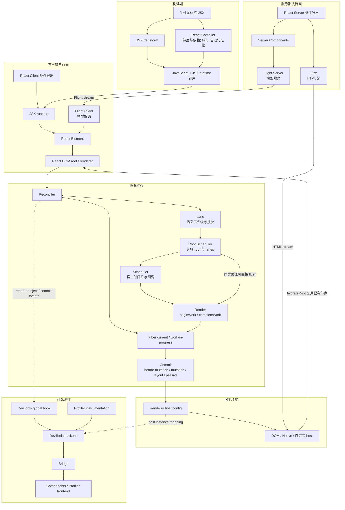
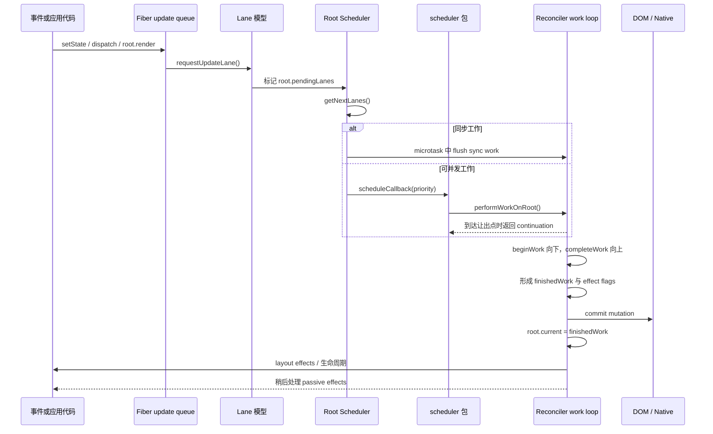
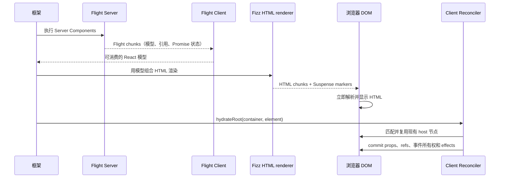
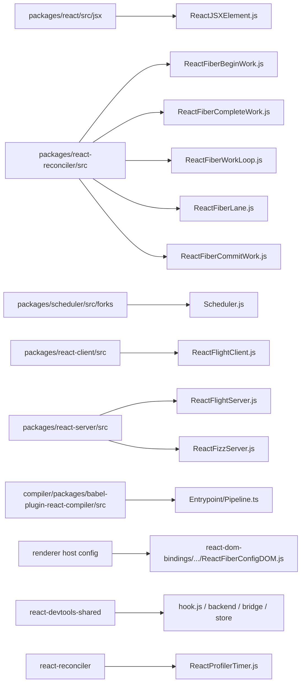

# React 核心概念关系总览

本文只回答一件事：JSX、React Compiler、Fiber、Reconciler、Scheduler、Commit、Lane、React Client 与 React Server 如何连接成一条完整链路。

## 一张分层图

关键点是：这些概念不是一条“每次都完整经过”的固定流水线。

- 没有启用 React Compiler 时，JSX 仍可正常工作。
- JSX 也可在服务器端执行并产生 Element。
- 同步更新可以不等待 `scheduler` 包的并发回调。
- Fizz 输出 HTML，Flight 输出 React 模型；两种流可以被框架组合，但不是同一种协议。
- Hydration 会让客户端 Fiber 接管已有 DOM，而不是让 JSX 再造一遍相同 DOM。

## 一次客户端更新

这里有三种不同的“优先级”需要分开：

| 层 | 代表 | 回答的问题 |
| --- | --- | --- |
| 事件优先级 | `DiscreteEventPriority` 等 | 这次更新由什么交互语义触发？ |
| React 工作优先级 | `Lane` / `Lanes` | 哪些更新应一起 render，哪些可阻塞、重试或过期？ |
| 宿主回调优先级 | Scheduler priority | 下一段 JavaScript 工作何时运行？ |

Root Scheduler 会把 Lane 选择映射成 Scheduler priority，但二者不是同一种类型，也不是简单一一对应。

## 首次服务端渲染与接管

这张图是常见框架组合路径，不代表 React 核心自动完成网络路由、模块清单生成或 Server Action 端点。那些属于 bundler 和框架职责。

## 所有权与输入输出

| 概念 | 主要输入 | 主要输出 | 不负责 |
| --- | --- | --- | --- |
| JSX | JSX 语法节点 | JSX runtime 调用 | 调度、DOM diff |
| React Compiler | 组件/Hook 函数 AST | 保持语义的优化后代码 | 执行组件、宿主提交 |
| Fiber | Element、更新与上次提交状态 | 可恢复树节点和工作记录 | 自己决定执行时机 |
| Reconciler | Element/更新、current Fiber 树 | finished Fiber 树与 effect flags | 直接硬编码 DOM |
| Lane | 更新语义和 root 状态 | 工作集合、优先级、阻塞/纠缠信息 | 安排浏览器消息循环 |
| Scheduler | 带优先级和超时的回调 | 分时执行与 continuation | 理解组件、Fiber 或 DOM |
| Commit | finishedWork 与 flags | host 变化、refs、layout/passive effects | 重新协调整棵 Element 树 |
| React Client | 客户端导出、DOM root、Flight 解码 | 客户端模型与交互运行时 | 自动提供服务器框架 |
| React Server | server 条件导出、Fizz/Flight 请求 | HTML 流或 Flight 模型流 | 浏览器 hydration 与 DOM 事件 |
| Renderer | Fiber commit 调用与 host config | host instance 的 create/update/remove | 组件身份与 Lane 选择 |
| React DevTools | renderer 注入、commit/unmount 事件 | 可检查的组件树与按需详情 | 改变应用正常协调语义 |
| Profiler | render/commit 插桩数据 | duration、commit 与 timeline 数据 | 直接给出业务瓶颈根因 |

## 源码地图

详细源码入口见各概念文档末尾的“源码导航”。

## 推荐的排错顺序

当一个现象看起来“React 没更新”时，不要把所有问题都归因于 reconciler：

1. 确认 JSX transform 和条件导出是否生成/加载了预期代码。
2. 确认更新是否进入对应 Fiber 的 queue。
3. 确认更新分配到哪个 Lane，是否被 suspended、entangled 或过期规则影响。
4. 确认 root 是否拿到回调，回调是同步 flush 还是 Scheduler 并发路径。
5. 确认 render 是完成、suspend、报错，还是被更高优先级工作重启。
6. 确认 finished tree 是否进入 commit，以及具体 flag 落在哪个 phase。
7. 最后检查 renderer 的 host config 和真实 DOM/Native 行为。
