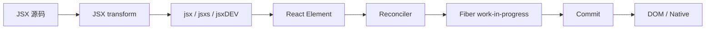

# JSX：声明式 UI 的语法入口

## 定位

JSX 是 JavaScript 的语法扩展，用于把树形 UI 描述写进 JavaScript。它本身不是模板引擎、React Element、Fiber 或 DOM。源码通常先由 Babel、TypeScript 或其他构建工具执行 JSX transform，再调用 React 提供的 JSX runtime。

```jsx
function Greeting({name}) {
  return <h1 className="title">Hello {name}</h1>;
}
```

自动 runtime 的概念化输出类似：

```js
import {jsx as _jsx} from 'react/jsx-runtime';

function Greeting({name}) {
  return _jsx('h1', {
    className: 'title',
    children: ['Hello ', name],
  });
}
```

这段代码得到的是 React Element 描述，不是 `<h1>` DOM 节点。

## 角色与职责

JSX 负责：

- 用接近最终树结构的形式表达 `type`、`props`、`children` 和 `key`。
- 给编译工具一个可静态识别的语法节点。
- 通过 `react/jsx-runtime` 或 `react/jsx-dev-runtime` 接到 React Element 创建逻辑。
- 在开发构建中携带静态 children、源码位置和调试栈等验证信息。

JSX 不负责：

- 调用组件并保存 Hook 状态。
- 比较新旧 UI。
- 创建 Fiber、分配 Lane 或安排 Scheduler 回调。
- 创建、更新或删除 DOM。
- 决定代码在客户端还是服务器执行；同一 JSX 语法可出现在两种环境中。

## 工作机制

### 1. 语法转换

经典 transform 产生 `React.createElement(...)`。自动 transform 直接从 JSX runtime 导入：

- `jsx`：动态 children 或单个 child。
- `jsxs`：编译器判定为静态 children 集合。
- `jsxDEV`：开发模式签名，携带更多验证信息。
- `Fragment`：`<>...</>` 对应的类型标记。

当前实现中 `jsx` 与 `jsxs` 的生产函数相同，但不同入口保留了静态 children 信息和未来优化空间。

### 2. 创建 React Element

`jsxProd(type, config, maybeKey)` 处理 `key` 和 props，然后调用内部 `ReactElement(...)`。核心结果可概括为：

```text
{
  $$typeof,
  type,
  key,
  props,
  ref,       // 生产构建仍保留兼容字段
  ...devInfo // 开发构建中的 owner/debug 信息
}
```

React 19 中 `props.ref` 是 ref 的事实来源；开发环境访问 `element.ref` 会经过兼容性提示。`key` 仍是 Element 身份字段，不会作为普通 `props.key` 传给组件。

### 3. 进入 Reconciler

Element 被传给 `root.render(element)`、作为组件返回值，或由 Flight Client 重建后，Reconciler 才会：

1. 在同一父 Fiber 的 children 范围内比较 `key` 与 `type`。
2. 决定复用、移动、插入或删除 Fiber。
3. 在 complete/commit 路径中把变化交给 renderer。

所以正确因果链是：



## JSX、Element 与 Fiber 的区别

| 对象 | 生命周期 | 是否可直接写出 | 主要用途 |
| --- | --- | --- | --- |
| JSX | 构建前源码 | 是 | 表达 UI |
| React Element | 每次计算得到的描述值 | 可通过 JSX 或 `createElement` 得到 | 作为协调输入 |
| Fiber | 跨 render 存活的内部节点 | 否，内部实现 | 保存状态、关系、工作与优先级 |
| host instance | 真实环境对象 | 通常由 renderer 创建 | 呈现 UI |

Element 接近“这次想要什么”，Fiber 接近“React 目前知道什么、还要做什么”，DOM/Native 节点则是“用户实际看到或宿主实际持有的对象”。

## `key` 为什么特殊

`key` 帮助 Reconciler 在**同一父节点的 child 集合内**匹配身份。它不是全局 ID。

- key 和 type 兼容时，旧 Fiber 及其状态才有机会复用。
- key 改变通常意味着卸载旧身份并挂载新身份。
- 没有 key 时列表通常退化为 index 匹配，重排可能把状态关联到错误项目。
- 即使 key 相同，把节点移动到另一个父 Fiber 下也不保证保留状态。

## 常见误解

### “JSX 会被编译成 HTML”

客户端 JSX 通常变成 JavaScript runtime 调用。只有服务端 HTML renderer（Fizz）进一步把 React 模型序列化为 HTML 流。

### “React Compiler 就是 JSX 编译器”

JSX transform 解决语法降级；React Compiler 进行 React 语义分析与自动记忆化。两者可以出现在同一构建流程中，但职责不同。

### “组件每次返回的是 DOM”

组件返回 React node 描述。Reconciler 和 renderer 决定是否以及如何改变 DOM。

### “Fragment 一定对应一个 DOM 节点”

JSX Fragment 是 React 类型标记，用来组合 children；它通常不会创建额外 DOM 容器。它也不是 hydration 内部的 `DehydratedFragment`。

## 源码导航

- [`packages/react/src/jsx/ReactJSX.js`](../../packages/react/src/jsx/ReactJSX.js)：`jsx`、`jsxs`、`jsxDEV` 与 `Fragment` 导出。
- [`packages/react/src/jsx/ReactJSXElement.js`](../../packages/react/src/jsx/ReactJSXElement.js)：Element 创建、`key`、`ref` 与开发验证。
- [`packages/react/jsx-runtime.js`](../../packages/react/jsx-runtime.js)：自动 JSX runtime 的包入口。
- [`packages/react/jsx-dev-runtime.js`](../../packages/react/jsx-dev-runtime.js)：开发 JSX runtime 的包入口。
- [`packages/react/src/__tests__/ReactJSXRuntime-test.js`](../../packages/react/src/__tests__/ReactJSXRuntime-test.js)：runtime 行为测试。

## 一句话总结

JSX 是声明 UI 的源码语法；它经 transform 调用 JSX runtime 产生 Element，真正的状态保存、协调、调度和宿主修改发生在后续系统中。

