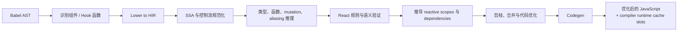
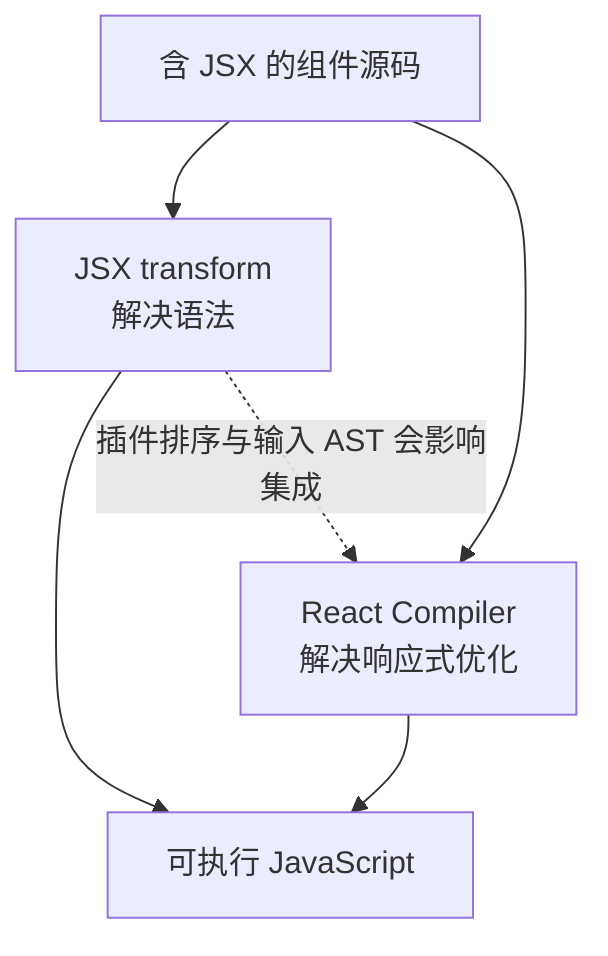

# React Compiler：构建期的 React 语义优化器

## 定位

React Compiler 在构建期分析组件和 Hook 函数，推导值的依赖、别名、可变范围与响应式作用域，再生成带自动记忆化的等价 JavaScript。目标是减少不必要的重新计算和子树更新，同时保持原程序可观察语义。

它不在浏览器中调度 Fiber，也不是 JSX transform 的新名字。

## 角色与职责

React Compiler 负责：

- 识别组件与 Hook 等可编译函数。
- 把 Babel AST 降级为 HIR（High-level Intermediate Representation，高层中间表示）。
- 转换到 SSA（Static Single Assignment，静态单赋值）形态，便于数据流推理。
- 推导类型、函数效应、mutation（修改）和 aliasing（别名）关系。
- 验证 Hooks、ref、render 纯度和手工 memo 等 React 规则。
- 建立 reactive scope（响应式作用域）及其依赖。
- 生成使用 compiler runtime 缓存槽的优化代码。
- 通过配置、指令、gating 和失败策略控制渐进采用。

它不负责：

- 把 JSX 最终提交到 DOM。
- 在运行时比较两棵 Fiber 树。
- 自动修复任意违反 React Rules 的动态代码。
- 证明所有应用都会变快；收益取决于组件结构、更新分布和运行环境。
- 替代 bundler、renderer、Scheduler 或 Server Components 框架。

## 为什么需要编译器

手工 `useMemo`、`useCallback` 和 `memo` 要求开发者准确维护依赖与边界。过少会重复计算，过多会增加比较、内存和心智成本。编译器尝试从程序语义推导“哪些值在输入未变时可复用”。

反事实是对任意 JavaScript 猜测依赖：一旦遗漏可变别名、动态属性或副作用，缓存就会返回过期结果。因此 Compiler 必须建立 IR、做效应分析并在不确定时保守处理或跳过编译。

## 工作机制

### 1. Babel 插件入口

`BabelPluginReactCompiler` 在 `Program.enter` 调用 `compileProgram`。Program 级入口保证编译器尽量靠近原始源码运行，也负责读取文件名、插件选项、开发模式和日志配置。

### 2. HIR 与 SSA

`Pipeline.ts` 中的 `lower` 先建立 HIR。之后的关键步骤包括：

- 清理可能抛错标记与立即调用函数。
- 合并控制流块并检查 CFG（控制流图）不变量。
- `enterSSA` 和冗余 phi 消除。
- 常量传播、类型推导和死代码消除。

SSA 让每个逻辑赋值有明确版本，降低“某个值究竟来自哪次写入”的推理难度。

### 3. 效应、mutation 与 aliasing

Compiler 分析函数调用可能做什么、一个对象是否被修改、多个变量是否指向同一对象，以及可变范围跨越哪些指令。这些结论直接影响缓存是否安全。

例如，两个变量若可能指向同一可变对象，就不能只观察其中一个标识符并假定另一个不变。

### 4. React 规则验证

管线包含一组可配置验证，例如：

- Hooks 调用是否合法。
- render 中是否访问 ref 的当前值。
- render 或 effect 中是否有不允许的 `setState` 模式。
- 手工 memo 的语义能否被保留。
- Context 变量和组件定义是否满足要求。

这些验证不是普通风格 lint；它们保护编译变换的语义前提。

### 5. Reactive scope

编译器推导某段计算依赖哪些值、哪些输出需要稳定身份，并把相关指令组织为 reactive scope。随后会：

- 合并一起失效的作用域。
- 去掉无依赖或总会失效的无效作用域。
- 处理 early return、循环、解构和临时变量。
- 为 codegen 对齐作用域与块边界。

### 6. 运行时缓存槽

生成代码可调用 React 暴露的 compiler runtime 缓存。缓存槽保存上次依赖和结果；依赖未变化时复用结果，变化时重新计算并写回。

这是“构建期分析 + 很薄的运行时缓存”协作，不是把整个 Compiler 打包进浏览器。

## 与 JSX transform 的关系

两者都操作源码，但问题不同：

| 工具 | 核心问题 | 典型结果 |
| --- | --- | --- |
| JSX transform | JavaScript 引擎不认识 JSX 语法 | `jsx(type, props)` |
| React Compiler | 哪些计算和身份可以安全复用 | cache slots 与条件重算 |

## 与运行时系统的关系

- Compiler 可减少 Reconciler 收到的新对象和需要深入处理的子树，但不替代协调。
- Compiler 生成的组件仍返回 Element，仍使用 Fiber、Lane、Scheduler 和 Commit。
- Compiler 必须遵守客户端与服务器条件导出的 API 差异。
- Server Components 可以被编译，但具体输出模式、模块边界与框架集成仍需配置。

## 失败边界与采用策略

应把以下结论分开：

- “文件编译成功”只证明 Compiler 接受了当前样本。
- “组件测试通过”是 `component` 级正确性证据。
- “交互端到端一致”才覆盖真实 renderer 与事件路径。
- “性能更好”需要基线、同一工作负载、浏览器 CPU/内存/commit 次数等测量。
- “可全量启用”还需要兼容性样本、回滚开关和稳态 soak。

Compiler 的保守跳过、panic threshold、`"use memo"` / `"use no memo"` 指令和 gating 都是部署控制面，不应被描述成自动保证。

## 常见误解

### “Compiler 会阻止所有 re-render”

它优化可证明的计算与身份边界。状态、Context 或 props 真正变化时，组件仍需重新计算或协调。

### “启用后应删除所有手工 memo”

手工 memo 可能是兼容契约或未覆盖路径的一部分。是否删除应由 Compiler 输出、行为测试和性能证据决定。

### “编译失败就是运行时错误”

Compiler 位于构建期。失败策略可能报错、记录诊断或跳过某个函数，取决于集成配置。

## 源码导航

- [`compiler/packages/babel-plugin-react-compiler/src/Babel/BabelPlugin.ts`](../../compiler/packages/babel-plugin-react-compiler/src/Babel/BabelPlugin.ts)：Babel 插件入口。
- [`compiler/packages/babel-plugin-react-compiler/src/Entrypoint/index.ts`](../../compiler/packages/babel-plugin-react-compiler/src/Entrypoint/index.ts)：`compileProgram` 与入口编排。
- [`compiler/packages/babel-plugin-react-compiler/src/Entrypoint/Pipeline.ts`](../../compiler/packages/babel-plugin-react-compiler/src/Entrypoint/Pipeline.ts)：HIR、SSA、推理、验证、作用域与 codegen 管线。
- [`compiler/packages/babel-plugin-react-compiler/src/HIR`](../../compiler/packages/babel-plugin-react-compiler/src/HIR)：高层中间表示。
- [`compiler/packages/babel-plugin-react-compiler/src/ReactiveScopes`](../../compiler/packages/babel-plugin-react-compiler/src/ReactiveScopes)：响应式作用域推导与优化。
- [`packages/react/src/ReactCompilerRuntime.js`](../../packages/react/src/ReactCompilerRuntime.js)：React 包中的 compiler runtime 入口。

## 一句话总结

React Compiler 用静态分析证明哪些值和子计算可以缓存，再生成薄运行时支持的优化代码；它优化 React 程序，却不承担 React 运行时的协调与提交。

