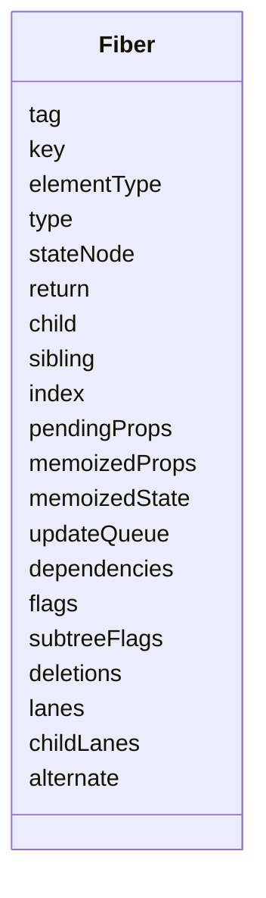
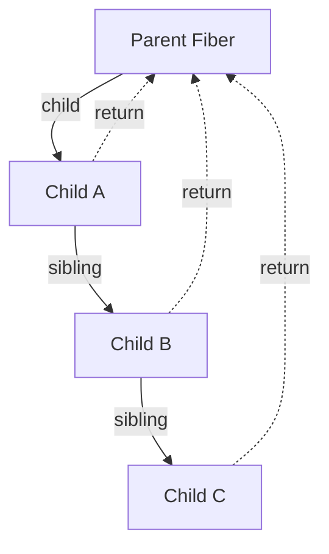
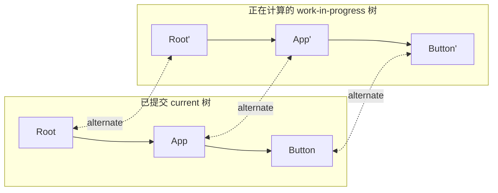
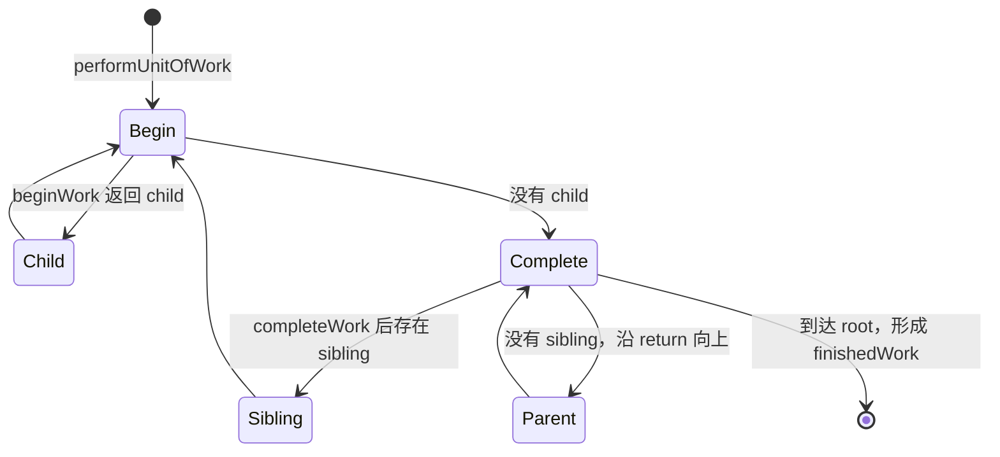

# Fiber：可恢复的工作单元与运行时树

## 定位

Fiber 是 React Reconciler 的内部数据结构。一个 Fiber 同时代表树中的一个逻辑节点，以及 React 处理这个节点所需的状态、优先级和副作用记录。

“Fiber”既不是浏览器线程，也不是组件实例的另一个名字。组件、Element、Fiber 和 host instance 是四种不同对象。

## 为什么需要 Fiber

如果协调只能使用 JavaScript 原生递归调用栈，一次深树遍历开始后就很难暂停、保存现场、切换到更紧急的更新，再从合适位置继续。

Fiber 把原本隐含在调用栈中的信息显式存进堆对象：

- 当前处理哪个节点。
- 父、子、兄弟是谁。
- 上次已提交输入与状态是什么。
- 这次待处理输入是什么。
- 自身和子树还有哪些 Lane。
- commit 需要执行哪些 effect。

因此 Reconciler 可以把遍历拆成 `performUnitOfWork(fiber)` 形式的工作单元。

## 核心字段



| 字段组 | 字段 | 责任 |
| --- | --- | --- |
| 身份 | `tag`、`key`、`elementType`、`type` | 判断工作类型和复用身份 |
| 宿主 | `stateNode` | 指向 DOM/Native 实例、root、class instance 等 |
| 树形关系 | `return`、`child`、`sibling`、`index` | 用链表表示可恢复遍历 |
| 输入与状态 | `pendingProps`、`memoizedProps`、`memoizedState` | 分隔这次输入与已提交结果 |
| 更新与依赖 | `updateQueue`、`dependencies` | 保存 state update、effects、Context 等 |
| 副作用 | `flags`、`subtreeFlags`、`deletions` | 告诉 commit 哪些节点需要处理 |
| 优先级 | `lanes`、`childLanes` | 标记自身与子树的待处理工作 |
| 双缓冲 | `alternate` | 连接 current 与 work-in-progress 两个版本 |

## 树的表示方式

Fiber 不使用 `children: []` 保存完整孩子数组，而使用：

```text
parent.child  -> firstChild
firstChild.sibling -> secondChild
secondChild.return -> parent
```



这种表示允许 work loop 在完成一个节点后找到 sibling，或沿 `return` 回到父节点继续 complete。

## 双缓冲：current 与 work-in-progress

React 通常为同一逻辑节点保留最多两个 Fiber：

- `current`：已经提交、与当前可见 UI 对应。
- `work-in-progress`：本次 render 正在计算的候选结果。

两者通过 `alternate` 相连。



render 被打断或失败时，可以放弃 work-in-progress，而 current 仍代表完整已提交状态。commit mutation 完成后，`root.current = finishedWork` 才让 finished tree 成为新 current。

这不是无限保存历史版本，也不是事务回滚日志。已发生的宿主 mutation 不会因为后续 commit error 自动回滚。

## Fiber 的创建与复用

### 初次创建

Element 进入 Reconciler 后，`createFiberFromElement` 根据 `type` 和 React symbol 选择 `tag`，创建 Fiber 并写入 `pendingProps`、`key`、`lanes` 等。

### 更新复用

同一父 Fiber 下，新的 child 描述会与 current child 比较：

- `key` 与 element type 兼容：创建/复用其 alternate 作为 work-in-progress，保留可兼容状态。
- 身份不兼容：旧 Fiber 标记删除，新建 Fiber。
- 位置改变但身份兼容：复用 Fiber，并由 `Placement` 等 flag 表达移动。

“复用 Fiber”不等于“什么都不做”。props、lanes、flags 和子树仍可能变化。

## Fiber 如何成为工作单元



- `beginWork` 主要消费输入、调用组件、处理 update queue 并协调 children。
- `completeWork` 主要创建/更新候选 host instance，向上汇总 flags 与 lanes。
- Scheduler 的让出发生在工作单元边界附近；Fiber 数据让“下次从哪里继续”成为可表达状态。

## Fiber 与状态

状态不存放在 JSX Element 中。不同组件类型的状态以不同形式挂在 Fiber：

- function component：`memoizedState` 指向 Hook 链表。
- class component：`stateNode` 指向 class instance，queue 与 memoized state 保存更新结果。
- HostRoot：保存根更新、cache、hydration 等状态。
- Suspense/Offscreen：`memoizedState` 保存边界是否 dehydrated、隐藏等内部状态。

因此组件身份变化会导致 Fiber 身份变化，并可能重置其状态链。

## Fiber 不负责什么

- 不自己选择下一组 Lane；Lane 算法和 Root Scheduler 负责。
- 不自己向浏览器申请时间片；`scheduler` 包负责可并发回调。
- 不硬编码 DOM 操作；renderer host config 负责。
- 不等于虚拟 DOM 快照。Fiber 还包含更新队列、调度、effects 和双缓冲关系。

## 常见误解

### “一棵 Fiber 树就是一棵 DOM 树”

function component、Fragment、Context、Suspense 等 Fiber 没有一一对应 DOM 节点；一个组件也可能返回多个 host child。

### “每次 render 都重建所有 Fiber”

work-in-progress 节点会通过 alternate 从 current 克隆/复用。身份不兼容的区域才创建全新逻辑节点。

### “Fiber 让 JavaScript 真正多线程执行”

Fiber 支持协作式中断和恢复，不把同一 Reconciler work loop 自动变成并行线程。

## 源码导航

- [`packages/react-reconciler/src/ReactFiber.js`](../../packages/react-reconciler/src/ReactFiber.js)：`FiberNode`、work-in-progress 与各种创建函数。
- [`packages/react-reconciler/src/ReactInternalTypes.js`](../../packages/react-reconciler/src/ReactInternalTypes.js)：Fiber/FiberRoot 类型与字段说明。
- [`packages/react-reconciler/src/ReactChildFiber.js`](../../packages/react-reconciler/src/ReactChildFiber.js)：child 身份匹配、插入、移动与删除。
- [`packages/react-reconciler/src/ReactFiberWorkLoop.js`](../../packages/react-reconciler/src/ReactFiberWorkLoop.js)：工作单元遍历、render 和 commit 编排。
- [`packages/react-reconciler/src/ReactFiberFlags.js`](../../packages/react-reconciler/src/ReactFiberFlags.js)：effect flags。

## 一句话总结

Fiber 把 React 树节点、已提交状态、待办工作和遍历现场合成可恢复的数据单元，使 Reconciler 能构建候选树、处理中断并把副作用延迟到 commit。

