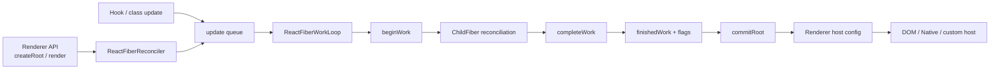
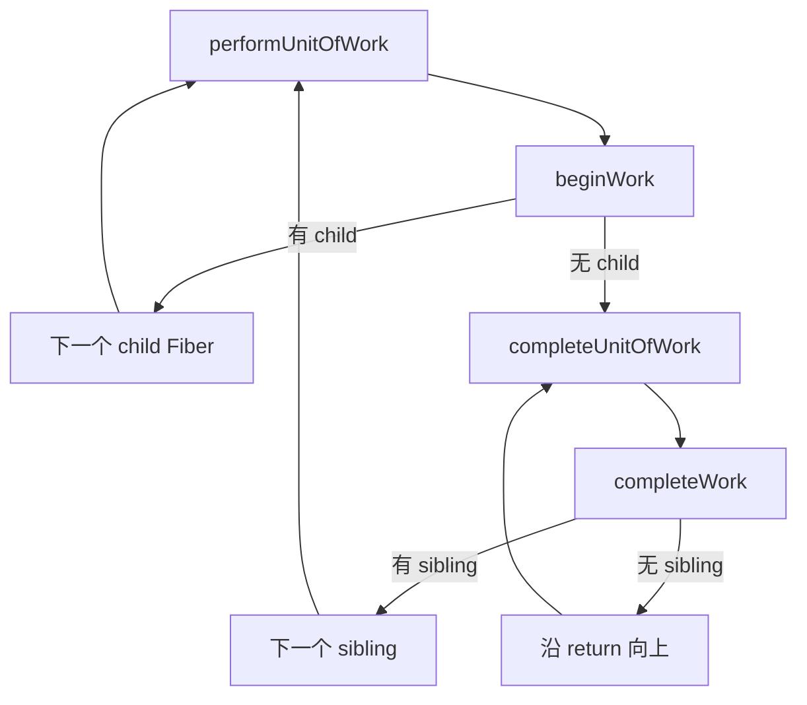

# Reconciler：把声明转换为可提交变化的协调核心

## 定位

Reconciler（协调器）接收 React Element、状态更新与已有 Fiber 树，计算下一棵 work-in-progress Fiber 树，并产出 commit 所需的 flags。它回答的是：

> 给定上次已经提交的 UI 和这次声明，哪些逻辑节点保留身份，哪些工作需要重算，最终宿主环境需要发生什么变化？

它是 `react-reconciler` 包的核心，但具体 DOM 操作由 renderer host config 提供。

## 角色与职责

Reconciler 负责：

- 创建 root 和 Fiber。
- 接收 `updateContainer`、Hook、class 等来源的更新。
- 为更新分配 Lane，并维护 root 的 pending/suspended/pinged 等状态。
- 在 render 阶段执行组件、处理 Hooks/Context/Suspense 和协调 children。
- 构造 finished Fiber tree，汇总 flags。
- 编排 commit 各子阶段，并在完成后重新调度剩余工作。
- 通过 host config 调用具体 renderer 能力。

它不负责：

- 解析 JSX 源码。
- 直接绑定某个宿主；核心算法不应知道 `document.createElement`。
- 承担宿主事件循环本身；并发回调交给 Scheduler。
- 保证所有更新都异步。
- 作为通用最小编辑距离算法比较任意两棵树。

## 外部边界



`ReactFiberReconciler.js` 是 renderer 与内部 work loop 的桥梁。它提供创建 container、更新 container、flush、查找 host instance 等能力，但公共 renderer 通常会再封装一层更稳定 API。

## 一次更新的工作机制

### 1. 入队

`setState`、Hook dispatch 或 `root.render` 创建 update，写入目标 Fiber 的 update queue。React 根据当前执行上下文、Transition 和事件语义请求一个 Lane。

### 2. 向 root 传播

更新 Lane 从目标 Fiber 沿 `return` 向上合并进 `childLanes`，并标记 `root.pendingLanes`。`ensureRootIsScheduled` 把 root 放进待调度链表。

### 3. 选择工作

Root Scheduler 在 microtask 中调用 `getNextLanes`，考虑：

- pending lanes。
- suspended 与 pinged lanes。
- 已过期工作。
- entanglement（纠缠）关系。
- 当前正在 render 的 lanes 是否值得被抢占。

同步工作直接进入 sync flush；其他工作映射为 Scheduler callback。

### 4. Render

Render 是可重做的计算阶段。



`beginWork` 依据 `tag` 分派：

- function component：调用 renderWithHooks。
- class component：处理 instance、state 和生命周期。
- HostComponent：协调 props.children。
- Context/Suspense/Offscreen 等：运行各自状态机。

`reconcileChildren` 只在同一父 Fiber 的 child 集合内做身份匹配。它不是跨全树寻找“最相似节点”。

`completeWork` 为 host 节点创建候选实例或准备更新，向父节点冒泡 `subtreeFlags` 与 `childLanes`。

### 5. 完成或恢复

Render 可能：

- 正常完成，产生 `finishedWork`。
- 因 thenable suspend，给边界安排 fallback、ping 或 retry。
- 因错误 unwind 到 error boundary/root。
- 因高优先级更新或一致性检查失败而重启。
- 在并发路径到达让出条件后保存 work-in-progress，稍后继续。

### 6. Commit

只有完成并通过提交前检查的 finished tree 才进入 commit。Reconciler 根据 flags 分阶段调用 host config、refs、生命周期和 effects。详见[Commit 阶段](06-commit-phase.md)。

## 协调不是通用 diff

React 使用基于身份与类型的启发式约束：

1. 不同 element type 通常意味着不同子树身份。
2. 同一父节点的列表用 key 帮助稳定匹配。
3. renderer 提供 host 类型与实例操作，不参与组件身份规则。

这让协调复杂度适合 UI 更新，但代价是开发者必须提供稳定 key，并理解移动父节点可能重置状态。

### 一个具体例子

旧 children：

```jsx
[<Row key="a" />, <Row key="b" />]
```

新 children：

```jsx
[<Row key="b" />, <Row key="a" />, <Row key="c" />]
```

Reconciler 可复用 `a`、`b` 的 Fiber 与兼容状态，为移动设置 Placement 相关工作，并新建 `c`。它不会因为数组 index 改变就必然销毁前两个节点。

## Bailout

如果某个 Fiber 的 props、Context 和相关 lanes 都没有要求继续工作，Reconciler 可以 bailout（提前退出），复用已有子树。

Bailout 不等于“组件永远不会更新”，也不只由 `memo` 决定。Lane、Context dependencies、childLanes 和类型专属逻辑都会影响是否可跳过。

## 与其他系统的边界

| 系统 | Reconciler 从它获得什么 | Reconciler 给它什么 |
| --- | --- | --- |
| JSX/Element | UI 描述 | 无直接反馈 |
| Fiber | 可恢复状态与树结构 | 新的 work-in-progress 字段 |
| Lane | 本次处理的工作集合 | root/Fiber 上的 lane 状态变化 |
| Scheduler | 可执行回调时机、让出信号 | continuation 或完成状态 |
| Renderer | host capability | create/update/remove 等调用 |
| Commit | finishedWork 与 flags | 新 current 树和后续调度 |

## 常见误解

### “Reconciler 就是 Virtual DOM diff”

它不仅匹配树，还处理更新队列、Hooks、Lane、Suspense、错误恢复、hydration 和 commit 编排。

### “React 会找出绝对最少 DOM 操作”

React 以可预测身份规则和线性级启发式为核心，不承诺任意树的全局最小编辑序列。

### “Render 调用了组件，所以可以安全写外部系统”

并发 render 可暂停、重做或放弃。对外副作用应放在正确的 commit/effect 边界。

## 源码导航

- [`packages/react-reconciler/src/ReactFiberReconciler.js`](../../packages/react-reconciler/src/ReactFiberReconciler.js)：renderer 到协调核心的入口。
- [`packages/react-reconciler/src/ReactFiberWorkLoop.js`](../../packages/react-reconciler/src/ReactFiberWorkLoop.js)：调度、render、异常和 commit 编排。
- [`packages/react-reconciler/src/ReactFiberBeginWork.js`](../../packages/react-reconciler/src/ReactFiberBeginWork.js)：按 Fiber tag 执行 begin 阶段。
- [`packages/react-reconciler/src/ReactChildFiber.js`](../../packages/react-reconciler/src/ReactChildFiber.js)：children 协调。
- [`packages/react-reconciler/src/ReactFiberCompleteWork.js`](../../packages/react-reconciler/src/ReactFiberCompleteWork.js)：complete 阶段与 host 候选工作。
- [`packages/react-reconciler/src/ReactFiberUnwindWork.js`](../../packages/react-reconciler/src/ReactFiberUnwindWork.js)：错误与 suspend 的 unwind。

## 一句话总结

Reconciler 是 React 的一致性引擎：它把新声明和旧 Fiber 状态协调成一棵可提交的新树，但把执行时间交给调度层，把真实平台操作交给 renderer。

