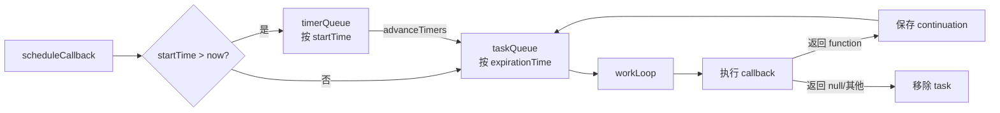
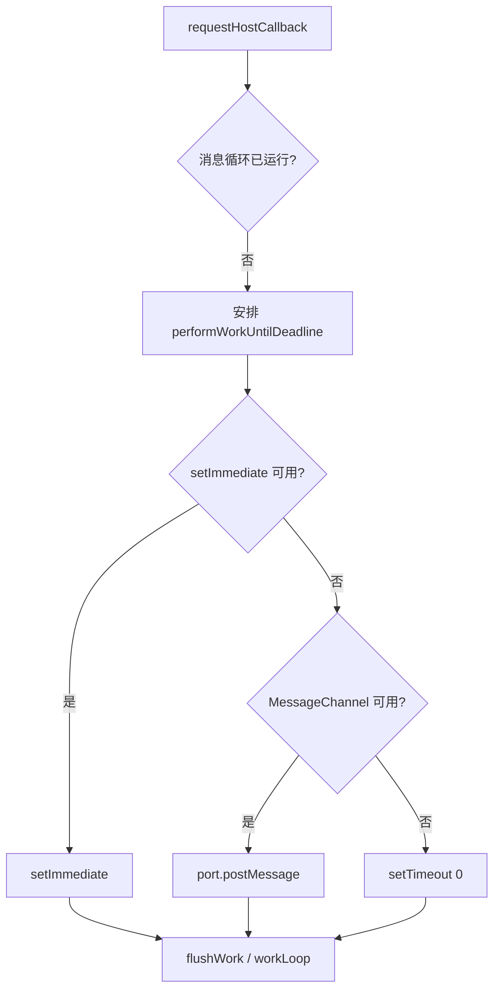
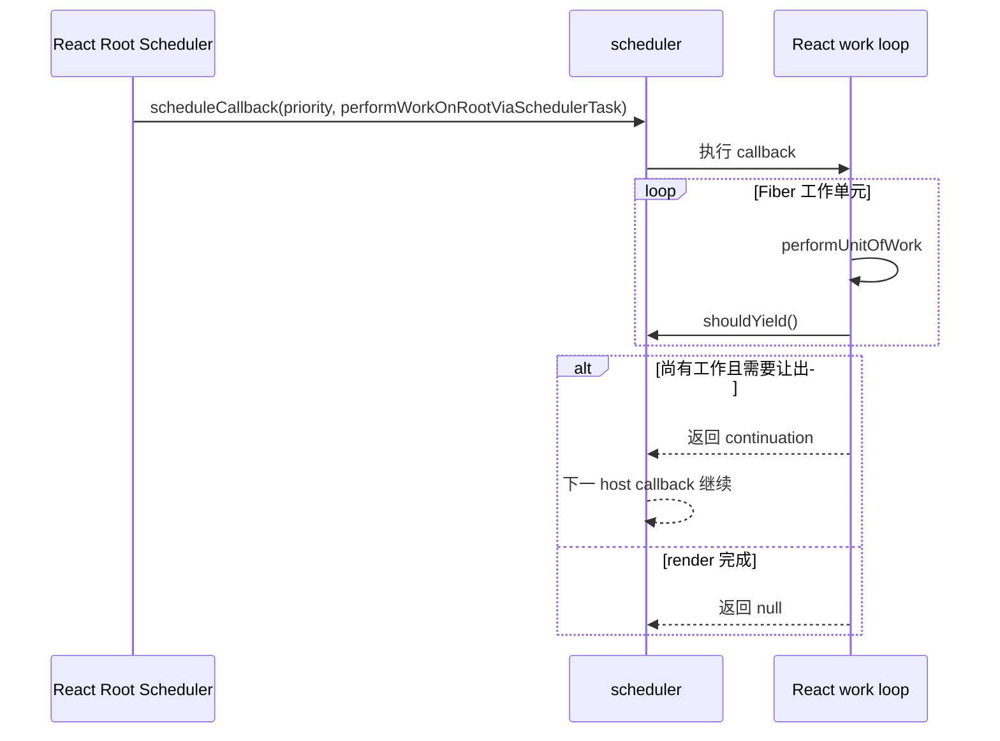

# Scheduler：宿主线程上的协作式任务调度

## 定位

`scheduler` 包是一个与 React 数据结构解耦的优先级任务调度器。它管理带优先级、开始时间和过期时间的 JavaScript callback，决定何时执行、何时让出，并支持 callback 返回 continuation 后继续。

它不知道 JSX、Fiber、Lane 或 DOM 的含义。

## 角色与职责

Scheduler 负责：

- 按优先级和 expiration time 排列就绪任务。
- 把延迟任务放进 timer queue，到达 start time 后转入 task queue。
- 向宿主事件循环申请执行机会。
- 在一个时间片内运行任务，并通过 `shouldYield` 避免长时间独占线程。
- 让 callback 返回 continuation，以便把剩余工作留到下一次机会。
- 取消尚未执行完成的 callback。

Scheduler 不负责：

- 决定一个 React update 属于哪个 Lane。
- 理解 Suspense、Transition 或组件树。
- 把任务变成 Web Worker 并行工作。
- 精确保证在某个毫秒点执行。
- 处理 React 的同步 flush；同步路径可绕过 Scheduler callback。

## 数据结构

默认 Scheduler 维护两个最小堆：

| 队列 | 排序键 | 内容 |
| --- | --- | --- |
| `timerQueue` | `startTime` | 未来才可执行的延迟任务 |
| `taskQueue` | `expirationTime` | 已可执行任务 |

每个 task 记录 id、callback、priorityLevel、startTime、expirationTime 和 sortIndex。

## 优先级与超时

Scheduler priority 包括 Immediate、UserBlocking、Normal、Low 和 Idle。调度时根据 priority 计算 expiration time。

优先级的作用不是简单“高优先级永远先跑”：

- 未过期任务在时间片用尽时可以让出。
- 已过期任务即使时间片用尽也会继续处理，以防饥饿。
- 延迟任务必须先到 start time。
- callback 主动返回 continuation 才能在逻辑工作未完时续跑。

React Root Scheduler 会把 Lane 结果映射到这些 priority，但 Lane 保留更丰富的 React 语义。

## 如何接入宿主事件循环

默认 fork 选择以下机制请求下一段工作：

1. 有 `setImmediate` 时优先使用，覆盖 Node.js 等环境。
2. 否则使用 `MessageChannel`，避免 `setTimeout` 的最小延迟钳制。
3. 最后退回 `setTimeout(..., 0)`。

这不是 `requestAnimationFrame`。Scheduler 的工作不一定与帧对齐；需要帧对齐的动画应由更合适的平台机制处理。

## 让出机制

`performWorkUntilDeadline` 记录当前时间片开始时间。`shouldYieldToHost` 在以下情况要求让出：

- host 请求尽快 paint，且相关 feature flag 启用。
- 当前时间片运行时间达到 `frameInterval`。

`workLoop` 在当前任务尚未过期时检查让出；若需要让出，就保留 task/continuation，安排下一次 host callback。

这是 cooperative scheduling（协作式调度）：Scheduler 只能在 callback 回到它并检查让出时切换，不能抢占一段不返回的用户 JavaScript。

## React 如何使用 Scheduler

同步 Lane 是关键反例：React 可以在 microtask 或显式 `flushSync` 路径直接执行同步 work，而不是先创建普通 Scheduler task。

## Scheduler 与 Lane 对照

| Lane | Scheduler |
| --- | --- |
| React 内部 31 位 bitmask | 通用 callback priority |
| 表达工作集合、纠缠、suspend、retry、hydration | 表达 callback 的宿主执行紧迫度 |
| 存在 Fiber 和 FiberRoot 上 | 存在 task queue 中 |
| 由 Reconciler/事件语义分配 | 由 Root Scheduler 映射并调度 |
| 可决定一次 render 包含哪些更新 | 不知道 callback 内处理哪些 Fiber |

## 常见误解

### “Scheduler 决定组件渲染顺序”

组件树的遍历顺序由 Reconciler work loop 决定。Scheduler 决定的是整段 callback 何时获得运行机会。

### “高优先级可以打断任意 JavaScript”

只有工作在安全点检查让出或返回控制权时才能切换。死循环和长同步函数仍会阻塞主线程。

### “React 的所有异步行为都来自 scheduler 包”

Promises、microtasks、host timeouts、网络流、passive effects 和框架调度还有其他机制。Scheduler 只是其中一个清晰边界。

## 源码导航

- [`packages/scheduler/src/forks/Scheduler.js`](../../packages/scheduler/src/forks/Scheduler.js)：默认任务队列、work loop、让出与 host callback。
- [`packages/scheduler/src/SchedulerMinHeap.js`](../../packages/scheduler/src/SchedulerMinHeap.js)：最小堆。
- [`packages/scheduler/src/SchedulerPriorities.js`](../../packages/scheduler/src/SchedulerPriorities.js)：priority 常量。
- [`packages/scheduler/src/forks/SchedulerPostTask.js`](../../packages/scheduler/src/forks/SchedulerPostTask.js)：基于 `postTask` 的另一 fork。
- [`packages/react-reconciler/src/ReactFiberRootScheduler.js`](../../packages/react-reconciler/src/ReactFiberRootScheduler.js)：React Lane 到 Scheduler callback 的桥。
- [`packages/react-reconciler/src/Scheduler.js`](../../packages/react-reconciler/src/Scheduler.js)：Reconciler 对 Scheduler 的内部导入边界。

## 一句话总结

Scheduler 是“什么时候给这段 JavaScript 时间”的宿主调度层；Lane 与 Reconciler 决定“这段时间里 React 应处理哪些工作”。

