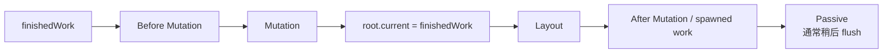
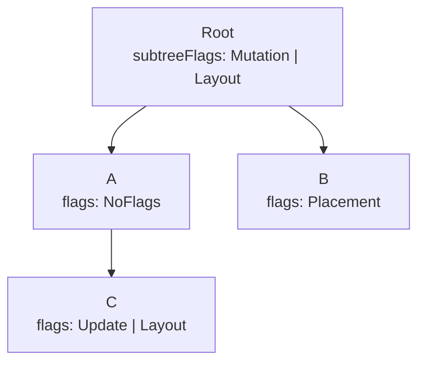

# Commit 阶段：把 finished tree 应用到宿主环境

## 名称说明

React 源码使用 `commit`、`commitRoot`、`ReactFiberCommitWork` 等名称。并不存在一个官方称为 “commiter” 的独立子系统；英文中若指执行提交的人通常拼作 “committer”，但在 React 架构中更准确的名称是 **Commit phase（提交阶段）** 与 **commit work（提交工作）**。

## 定位

Render 阶段只计算候选 work-in-progress Fiber 树。Commit 阶段接收已经完成的 `finishedWork` 与 effect flags，把它变成新的 current tree，并通过 renderer host config 修改 DOM、Native 或其他宿主。

这条边界保护用户不会看到半棵 render 中间树。

## 角色与职责

Commit 负责：

- 在 mutation 前读取必要的宿主快照。
- 执行插入、移动、属性更新、文本更新和删除。
- 切换 `root.current`。
- 连接或清理 ref。
- 运行 class commit 生命周期与 layout effects。
- 安排和处理 passive effects。
- 记录 profiler、错误和剩余工作，并再次调度 root。

Commit 不负责：

- 再次运行完整 child reconciliation。
- 选择这次 render 的 Lane。
- 保证像数据库事务一样原子回滚。
- 允许任意长工作安全地被 Scheduler 中断。
- 直接硬编码所有 DOM 操作；它调用 renderer host config。

## 为什么 render 与 commit 必须分开

Render 可能因更高优先级工作、Suspense、错误或一致性检查而被重做。如果 render 过程中直接修改屏幕，放弃 work-in-progress 后就会留下新旧状态混合的 host tree。

因此约束是：

- Render 可中断、可重做，不能对**已连接的外部宿主树**产生不可撤销修改。
- Render 可以构建尚未连接的候选 host instance。
- Commit 才把完成结果连接到可见宿主，并运行与已提交状态有关的 effects。

## Commit 子阶段



当前源码还包含 View Transition、gesture、资源等待等分支，可能让 commit 编排出现暂停或额外阶段；以下是核心语义。

### 1. Before Mutation

在真实 host mutation 前读取信息。典型工作包括 class component 的 `getSnapshotBeforeUpdate`，以及 mutation 前需要捕获的宿主状态。

DOM renderer 的 `prepareForCommit` 还可保存 selection、禁用事件等全局提交前状态。

### 2. Mutation

执行真实宿主变化：

- Placement：插入或移动 host instance。
- Update：调用 `commitUpdate`。
- ChildDeletion：卸载并从 host parent 移除节点。
- 文本更新：调用 `commitTextUpdate`。
- effect/ref 的部分清理。
- 可见性与 hydration 相关 mutation。

mutation 完成后才执行：

```js
root.current = finishedWork;
```

这个顺序保证卸载期间旧树仍是 current，而 layout 阶段看到的已经是新树。

### 3. Layout

host tree 已经改变，React 运行需要同步读取新布局或已提交实例的逻辑：

- `useLayoutEffect` create。
- class `componentDidMount` / `componentDidUpdate`。
- ref attach。
- 某些 profiler 与 transition 回调。

Layout effect 会阻塞浏览器继续处理当前主线程工作，因此不应放入不需要同步布局的重任务。

### 4. Passive

`useEffect` 的 cleanup/create 属于 passive effects。React 通常安排后续回调处理，但在特定同步路径或新更新触发下也可能提前 flush。

Passive 不是“永远等浏览器 paint 后才运行”的严格定时 API。应用不应依赖某个精确帧顺序。

## Effect flags 如何驱动遍历

Render/complete 阶段在 Fiber 上设置 `flags`，并把子树相关位汇总到 `subtreeFlags`。Commit 每个 phase 用自己的 mask 判断是否需要进入某个分支。



Mutation pass 可以跳过完全没有 MutationMask 的子树；Layout pass 同理。这避免每个 phase 无条件扫描全部节点。

## 删除为什么复杂

删除一个组件子树不只是 `removeChild`：

1. 遍历 Fiber 子树，运行 effect cleanup 和 class 卸载生命周期。
2. detach ref。
3. 找到最上层需要从 host parent 移除的 host node。
4. 处理 Portal、Offscreen、Suspense 等特殊结构。
5. 清理 Fiber 连接，帮助 GC 并防止已卸载节点被误用。

Host config 的 `removeChild` 通常只收到应从实际 parent 移除的顶层 host child，不需要重复遍历整个逻辑 Fiber 子树。

## 错误语义

Commit 不是 rollback transaction：

- 某个 mutation 已执行后，后续 layout effect 抛错不会自动把宿主恢复到提交前。
- React 会捕获可处理的 commit error，并安排 error boundary/root 的后续恢复更新。
- Host mutation hook 应尽量小、确定且不抛错。
- 外部系统若要求事务语义，必须在 renderer/应用边界自行设计幂等、补偿或原子替换。

## 与 Scheduler 的关系

Render 的并发 work loop可以按时间片让出。普通 mutation/layout commit 则集中执行，以保持提交顺序和已完成树的一致性。

Passive effects 可以通过 Scheduler callback 等机制稍后处理，但不能据此说“整个 commit 都由 Scheduler 随意切片”。

## 一个按钮更新例子

```jsx
function Counter() {
  const [count, setCount] = useState(0);
  useLayoutEffect(() => {
    console.log('layout', count);
  }, [count]);
  useEffect(() => {
    console.log('passive', count);
  }, [count]);
  return <button onClick={() => setCount(count + 1)}>{count}</button>;
}
```

概念顺序：

1. render 计算新的文本 child，并给 HostText/HostComponent 设置更新 flag。
2. mutation phase 把按钮文字从 `0` 改为 `1`。
3. `root.current` 切到 finished tree。
4. layout phase 同步打印 `layout 1`。
5. passive effects flush 时打印 `passive 1`。

具体浏览器 paint 与日志相对时机不要超出源码保证做绝对化推断。

## 源码导航

- [`packages/react-reconciler/src/ReactFiberWorkLoop.js`](../../packages/react-reconciler/src/ReactFiberWorkLoop.js)：`commitRoot` 与各 phase 编排。
- [`packages/react-reconciler/src/ReactFiberCommitWork.js`](../../packages/react-reconciler/src/ReactFiberCommitWork.js)：effect 遍历、生命周期、ref、删除与 host hook 调用。
- [`packages/react-reconciler/src/ReactFiberCommitEffects.js`](../../packages/react-reconciler/src/ReactFiberCommitEffects.js)：Hook 与 class commit effects。
- [`packages/react-reconciler/src/ReactFiberFlags.js`](../../packages/react-reconciler/src/ReactFiberFlags.js)：phase masks 与 flags。
- [`packages/react-dom-bindings/src/client/ReactFiberConfigDOM.js`](../../packages/react-dom-bindings/src/client/ReactFiberConfigDOM.js)：DOM mutation hooks。

## 一句话总结

Commit 是 React 从“候选结果”跨越到“宿主现实”的边界：它按 phase 消费 Fiber flags、修改 host、切换 current 并运行已提交 effects，但不是可回滚事务。

