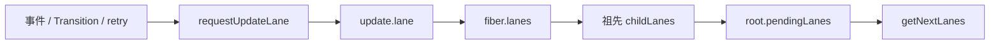
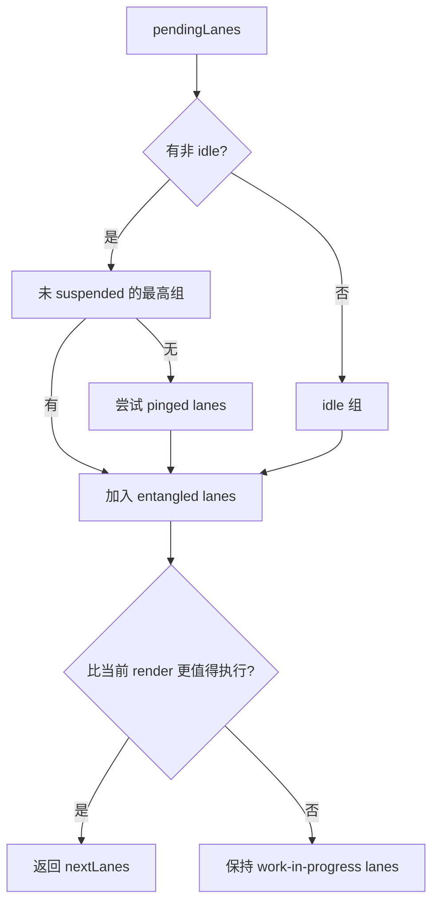
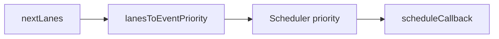

# Lane：React 更新的语义优先级与工作集合

## 定位

Lane 是 React Reconciler 内部用 bit 表示的一类工作通道；`Lanes` 是多个 Lane 的 bitmask 集合。当前实现用 31 个 bit 表达同步、连续输入、默认、Transition、Retry、Hydration、Idle、Offscreen、Deferred 等工作。

Lane 不等于线程、队列或 Scheduler priority。

## 为什么不是单个数字优先级

React 不只需要回答“谁更急”，还需要：

- 把可一起处理的更新合并为集合。
- 从集合中移除已完成部分。
- 表达多个 Transition 或 Retry 通道。
- 标记工作 suspended、pinged、expired 或 entangled。
- 让 Fiber 子树快速说明“这里是否包含本次 lanes 的工作”。

bitmask 使集合运算可以用按位操作完成：

```js
const merged = laneA | laneB;
const includesA = (merged & laneA) !== 0;
const withoutA = merged & ~laneA;
```

## 主要 Lane 组

当前 `ReactFiberLane.js` 的大致顺序从较紧急到较不紧急：

```text
SyncHydration
Sync
InputContinuousHydration
InputContinuous
DefaultHydration
Default
Gesture
TransitionHydration
Transition lanes
Retry lanes
SelectiveHydration
IdleHydration
Idle
Offscreen
Deferred
```

具体 bit 分配是内部实现细节，会随 feature flag 和版本演进；业务代码不应依赖 bit 数值。

## 角色与职责

Lane 系统负责：

- 为新更新选择语义通道。
- 在 Fiber/FiberRoot 上传播待处理工作。
- 选择 root 下一批可工作的 lanes。
- 避免选择 suspended 且未 ping 的工作。
- 对长期饥饿工作标记 expiration。
- 表达 entanglement，使相关 lanes 一起完成。
- 为 hydration、retry、offscreen 等专用路径提供区分。

Lane 不负责：

- 向浏览器申请 callback。
- 决定组件 children 的匹配规则。
- 直接衡量真实用户端延迟。
- 保证每个 Lane 都对应一个独立 render。

## 更新如何获得 Lane

`requestUpdateLane(fiber)` 会参考：

- 当前 Fiber mode。
- 是否正在 render phase。
- 是否处于 Transition/Async Action。
- 当前 update priority。
- 特殊 gesture/deferred/retry 上下文。

结果写入 update，并通过调度路径传播到 FiberRoot。



## FiberRoot 上的 Lane 状态

| 字段 | 含义 |
| --- | --- |
| `pendingLanes` | root 尚未完成的全部工作 |
| `suspendedLanes` | 因数据/资源等暂停的工作 |
| `pingedLanes` | suspend 条件已唤醒，可重试 |
| `expiredLanes` | 等待过久，应避免继续让出 |
| `entangledLanes` | 与其他 lane 存在一起完成约束 |
| `errorRecoveryDisabledLanes` | 特定恢复策略不应使用的 lane |

还有 event times、expiration times、entanglement map 等按 Lane 索引的元数据。

## `getNextLanes` 的核心决策

概念上：

1. 从 `pendingLanes` 开始。
2. 优先找没有 suspended 的最高优先级非 idle 工作。
3. 若都 suspended，尝试已 pinged 工作。
4. 合并 entangled lanes。
5. 与当前 work-in-progress lanes 比较，判断是否值得中断当前 render。
6. 返回一组 Lanes，而不一定只返回单个 Lane。



## Entanglement

Entanglement（纠缠）表示某些 lanes 不能独立提交，否则可能暴露不一致状态。典型来源包括 Transition 和 async action 相关更新。

这不是把全局所有 Transition 永久合并；它记录在具体 root 的 lane map 上，并随完成状态清理。

## Starvation 与 expiration

低优先级工作如果持续被更紧急更新抢占，可能饥饿。`markStarvedLanesAsExpired` 根据事件/过期时间把等待过久的 lanes 标为 expired。后续 work loop 对 expired work 不再按普通并发方式频繁让出。

Expiration 是调度保护，不等于业务 SLO。真实端到端延迟还包括事件、render、commit、浏览器、网络与应用工作。

## Lane 到 Scheduler priority

Root Scheduler 先选择 next lanes，再通过事件优先级映射成 Scheduler priority：



多个 Lane 组可能映射到同一个 Scheduler priority，因此不能从 Scheduler task 反推出完整 Lane 语义。

## 一个 Transition 反事实

用户在输入框输入，同时启动昂贵列表过滤：

- 输入框受控值更新需要快速反映，通常走更紧急的交互更新语义。
- `startTransition` 内列表更新获得 Transition lane。
- 更紧急更新可使正在进行的 Transition render 重启。
- Transition suspend 时，已显示内容可按 Suspense 策略保留。

如果只有单一 FIFO 队列，两类更新只能按入队顺序执行，昂贵过滤可能阻塞输入反馈。

## 常见误解

### “Lane 越多就会开越多线程”

Lane 是 bitmask 分类。React 仍可在一个 JavaScript 线程上协作式处理。

### “每次 setState 都有唯一 Lane”

多个更新可以共享 Lane；一个 render 也可以处理一组 Lanes。

### “TransitionLane 就永远不会同步”

具体执行受 root 状态、过期、flush、错误恢复和其他上下文影响。Lane 表达语义，不是对墙钟时序的绝对承诺。

## 源码导航

- [`packages/react-reconciler/src/ReactFiberLane.js`](../../packages/react-reconciler/src/ReactFiberLane.js)：Lane 定义、选择、完成、suspend、ping、expiration 与 entanglement。
- [`packages/react-reconciler/src/ReactFiberWorkLoop.js`](../../packages/react-reconciler/src/ReactFiberWorkLoop.js)：请求 Lane、传播更新与按 lanes render。
- [`packages/react-reconciler/src/ReactFiberRootScheduler.js`](../../packages/react-reconciler/src/ReactFiberRootScheduler.js)：next lanes 与 callback 调度。
- [`packages/react-reconciler/src/ReactEventPriorities.js`](../../packages/react-reconciler/src/ReactEventPriorities.js)：Lane 与事件优先级的桥。
- [`packages/react-reconciler/src/ReactFiberConcurrentUpdates.js`](../../packages/react-reconciler/src/ReactFiberConcurrentUpdates.js)：并发 update 入队与 lane 传播。

## 一句话总结

Lane 是 React 对“哪些更新属于哪种语义、应何时一起处理”的紧凑表达；Scheduler 再把选出的工作映射到宿主执行时间。

