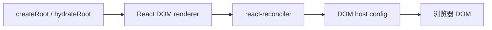
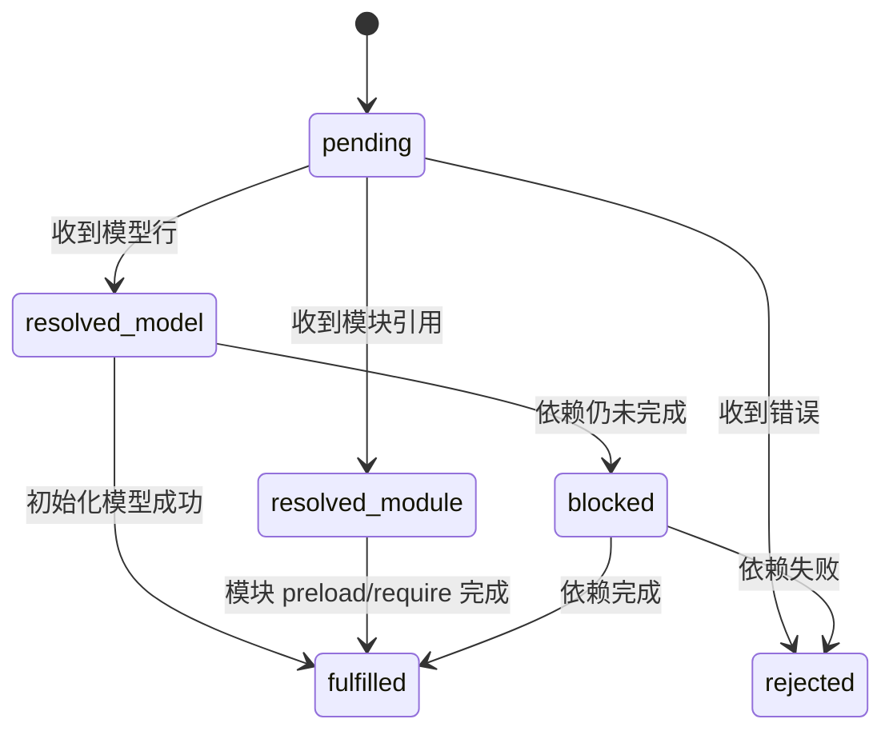
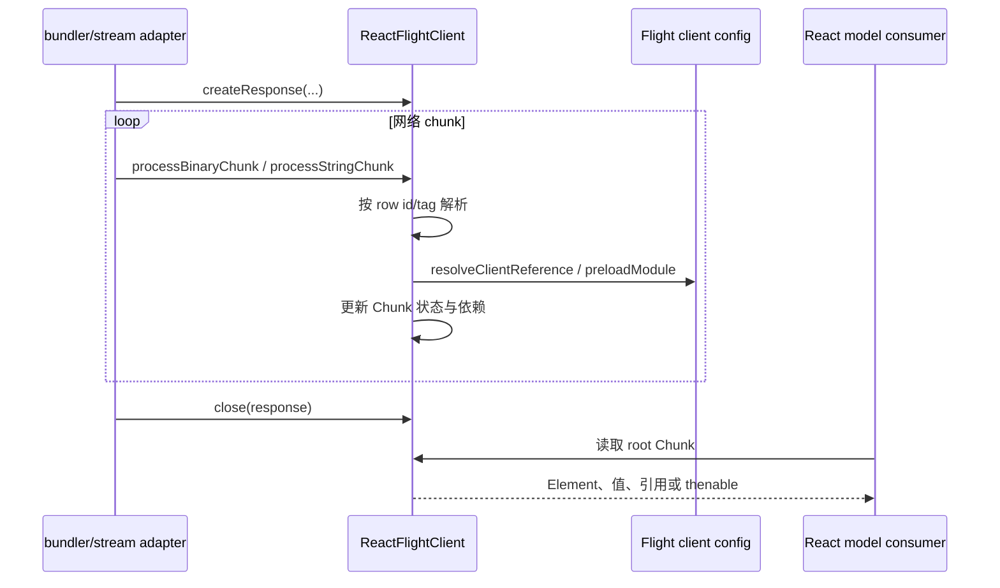
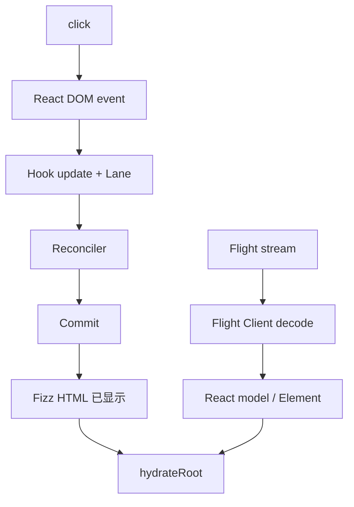

# React Client：客户端运行时与 Flight 消费端

## 先消除名称歧义

“React Client”在仓库中至少有三种相关含义：

1. [`packages/react/src/ReactClient.js`](../../packages/react/src/ReactClient.js)：`react` 包在客户端条件下的 API 导出。
2. `react-dom/client`：浏览器 DOM root API，如 `createRoot`、`hydrateRoot`。
3. [`packages/react-client`](../../packages/react-client)：Flight 协议的通用客户端解码内核。

“Client Component”则是 Server Components 模块图中的执行边界。它通常使用 `"use client"` 标记并由框架/bundler 处理，不等于“源码位于 `packages/react-client`”。

## 客户端 React API 面

`ReactClient.js` 导出客户端可用的 API，包括：

- `Component`、`createElement`、Context、memo、lazy。
- 完整客户端 Hooks，如 `useState`、`useEffect`、`useLayoutEffect`。
- Transition、Action state、optimistic state 等。
- 客户端 `ReactSharedInternals`。
- React Compiler runtime。

对应的 server 条件导出故意缺少 `useState`、`useEffect` 等客户端状态/effect API。条件导出由包构建和运行环境选择。

## React DOM client root

`react-dom/client` 暴露：

- `createRoot(container)`：创建客户端 FiberRoot。
- `hydrateRoot(container, children)`：创建 hydration root，尝试复用服务器 HTML。

Root API 是应用进入 Reconciler 的公共边界。事件系统、DOM 属性、资源、hydration 和 selection 等具体能力主要位于 `react-dom-bindings`。

## Flight Client

`packages/react-client` 的主要职责是消费 Flight stream，并把协议 chunk 恢复成可被 React/框架使用的模型。

### Chunk 状态机

Flight Client 为每个 id 管理 Chunk。主要状态包括：

Chunk 具有 thenable 行为，因此 React 的 `use` / Suspense 路径可以等待未完成模型。

### 解码流程

Flight Client 不直接假设 Webpack。`ReactFlightClientConfig` 通过 fork 适配 Webpack、Turbopack、Parcel、ESM、Node、Edge 等环境。

## Client Reference 与 Server Reference

### Client Reference

Flight Server 不执行 Client Component 实现，而是把模块引用编码进流。Flight Client 结合 bundler manifest：

1. 解析模块 id/export name。
2. preload 对应模块。
3. require 模块并获得导出。
4. 恢复为 React 可使用的 component type。

### Server Reference

Flight Client 可以恢复 server reference，并通过框架传入的 `callServer` 回调触发服务器调用。React 核心描述与编码引用，但不会自动创建 HTTP 路由、鉴权或 CSRF 策略。

## Hydration

Hydration 属于 React DOM Client + Reconciler，而不是 Flight Client 单独完成：

1. 浏览器已解析 Fizz HTML。
2. `hydrateRoot` 创建 hydration container。
3. Reconciler 的 hydration context 匹配已有 DOM。
4. Commit 绑定 props、事件所有权、refs 和 effects。

服务器 HTML 已经可见，不代表相应 Suspense boundary 已完成客户端 ownership。

## 客户端运行时负责与不负责

| 负责 | 不负责 |
| --- | --- |
| client API 与 Hooks | 执行 Server Component |
| 创建/hydrate DOM root | 生成服务器 HTML |
| DOM 事件与 host config 集成 | 自动拆分模块图 |
| Flight stream 解码 | 自动实现 server endpoint |
| 恢复 Client/Server Reference | 把不可信服务端数据变可信 |

## 一个完整客户端例子

Flight 数据提供模型，Hydration 建立 Fiber 与已有 DOM 的关系，后续交互更新走普通客户端 Reconciler。

## 常见误解

### “带 `'use client'` 的文件只在浏览器执行一次”

它定义客户端模块图边界；组件仍可参与服务端预渲染表示，并在浏览器 hydration 后继续 render。具体策略由框架决定。

### “Flight Client 就是 React DOM”

Flight Client 解码协议，React DOM 操作 DOM。Flight Client 也可运行在 SSR 或其他消费环境。

### “Server Action 函数被直接发到浏览器”

客户端拿到的是 reference 与调用能力，不是服务器函数实现本身。

## 源码导航

- [`packages/react/src/ReactClient.js`](../../packages/react/src/ReactClient.js)：客户端 React 条件导出。
- [`packages/react-dom/src/client/ReactDOMClient.js`](../../packages/react-dom/src/client/ReactDOMClient.js)：`react-dom/client` 入口。
- [`packages/react-dom/src/client/ReactDOMRoot.js`](../../packages/react-dom/src/client/ReactDOMRoot.js)：`createRoot`、`hydrateRoot`。
- [`packages/react-client/src/ReactFlightClient.js`](../../packages/react-client/src/ReactFlightClient.js)：Flight response、Chunk 状态机与行解析。
- [`packages/react-client/src/ReactFlightClientConfig.js`](../../packages/react-client/src/ReactFlightClientConfig.js)：bundler/目标环境配置边界。
- [`packages/react-client/src/ReactFlightReplyClient.js`](../../packages/react-client/src/ReactFlightReplyClient.js)：reply 与 Server Reference 客户端支持。

## 一句话总结

React Client 既包括浏览器中的 React/DOM 运行时，也包括 Flight 模型消费端；前者管理交互与宿主，后者恢复服务器模型，两者由 renderer 和框架组合。

