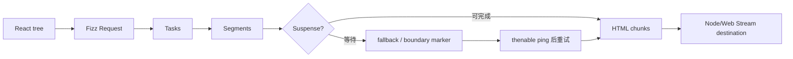
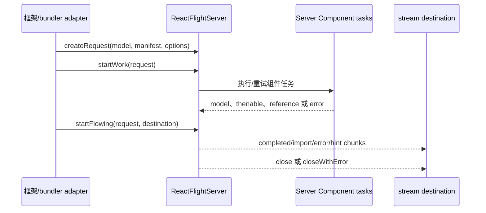
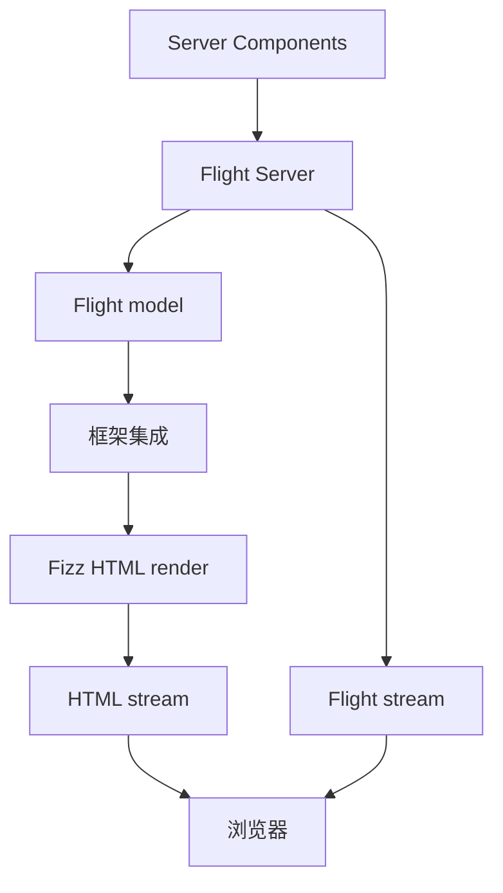

# React Server：服务器条件导出、Fizz 与 Flight

React Server Components 的模块图、执行、序列化和引用机制另见[《React Server Components》](13-react-server-components.md)。

## 先消除名称歧义

“React Server”不是单一 renderer。当前仓库中的相关层次包括：

1. [`packages/react/src/ReactServer.js`](../../packages/react/src/ReactServer.js)：`react` 包的 server 条件导出。
2. Fizz：将 React tree 流式序列化为 HTML。
3. Flight Server：执行 Server Components 并把 React 模型编码为 Flight stream。
4. `react-dom/server` 与 `react-server-dom-*`：面向不同 runtime/bundler 的公共适配入口。

Server Components、server rendering 和 Server Actions 互相关联，但不是同一概念。

## Server 条件导出

服务器 React API 面保留 Element、Fragment、Suspense、`use`、server cache 等能力，但不导出客户端状态/effect Hooks，例如 `useState`、`useEffect` 和 `useLayoutEffect`。

这个差异建立了能力边界：服务器 render 不拥有浏览器交互生命周期，也没有可提交的客户端 DOM layout effect。

## Fizz：HTML renderer

Fizz 的输入是 React tree，输出是 HTML/markup stream。

### 职责

- 创建 request、task、segment 和 boundary。
- 执行组件并生成 host markup。
- 在 Suspense 边界等待时先发送可用 shell/fallback。
- 数据完成后流出后续 segment 和完成指令。
- 支持 prerender、resume、abort、错误与 backpressure。

### 机制

Fizz marker 让客户端识别完整、pending 或 client-rendered Suspense range。HTML 可见与 hydration 完成是两个不同状态。

## Flight Server：React 模型 renderer/协议生产端

Flight Server 执行 Server Components，把结果编码成带 id/tag 的 rows/chunks。输出可以表示：

- React Element/model。
- primitives、对象、Map、Set 等支持值。
- Promise/thenable 与异步序列。
- Client Reference。
- Server Reference。
- 错误、调试栈、console/debug/performance 信息。
- preload hints。

它输出的不是 HTML。

### Request 生命周期

`scheduleWork`、`scheduleMicrotask` 和 stream config 由运行环境 fork 提供，Node、Edge、Browser/Bun 等 destination 能力不同。

## Client Reference

Server Component 遇到 Client Component 时不能直接执行浏览器实现并把闭包发送过去。Bundler integration 将其注册为 Client Reference，Flight Server 编码模块元数据，客户端再通过 manifest 解析并加载。

这要求框架/bundler维护一致的模块图和 manifest。React 核心不扫描整个应用并自动生成所有部署产物。

## Server Reference 与 Action

Server Reference 表示客户端可请求服务器调用的函数引用。协议可以编码 id 和 bound arguments，但生产系统还必须由框架负责：

- endpoint 与 transport。
- 身份认证和授权。
- CSRF、origin 和输入验证。
- 版本/部署一致性。
- 重试、幂等和错误呈现。

“函数有 `'use server'`”不能替代安全边界。

## Fizz 与 Flight 如何组合

常见框架同时把 HTML 和 Flight 数据送给浏览器：

- HTML 提供首屏内容和渐进显示。
- Flight 数据提供 RSC 模型、引用与后续导航所需信息。

二者可能共享一次应用请求的上下文，但协议、消费者和缓存键不能混为一谈。

## React Server 不负责什么

- 不自动监听 HTTP 端口。
- 不决定 URL 路由和数据权限。
- 不自动生成 bundler manifest。
- 不在服务器安装浏览器事件处理器。
- 不替客户端完成 hydration。
- 不保证任意值可序列化。

## 缓存与请求隔离

服务器 cache 需要由 dispatcher/request context 提供生命周期。个性化数据不能仅按组件名或公开 URL 全局复用；缓存键必须覆盖用户、locale、权限、部署版本等真实变体。

Flight taint API 可阻止某些对象或值被序列化，但它不是完整访问控制。权限判断必须发生在服务器数据访问和 action 执行边界。

## 常见误解

### “SSR 就是 Server Components”

SSR/Fizz 产出 HTML；Server Components/Flight 产出 React 模型。传统 Client Component tree 也可以被 SSR。

### “服务器渲染后客户端不需要 React”

纯静态页面可以不 hydrate；需要 React 交互的页面仍需客户端 runtime 接管对应边界。

### “Flight 是 JSON API”

Flight 使用带引用、模块、Promise、错误和 React 类型语义的专用流协议，不是普通 JSON 文档。

### “服务器组件不能 suspend”

Flight 与 Fizz 都有 task/thenable/ping 机制，用于等待异步结果并继续流式工作。

## 源码导航

- [`packages/react/src/ReactServer.js`](../../packages/react/src/ReactServer.js)：server 条件导出。
- [`packages/react-server/src/ReactFizzServer.js`](../../packages/react-server/src/ReactFizzServer.js)：Fizz request/task/segment/boundary 与 HTML 流。
- [`packages/react-server/src/ReactFlightServer.js`](../../packages/react-server/src/ReactFlightServer.js)：Flight request/task 与模型编码。
- [`packages/react-server/src/ReactServerStreamConfig.js`](../../packages/react-server/src/ReactServerStreamConfig.js)：服务器 stream host config 边界。
- [`packages/react-server/src/ReactFlightServerConfig.js`](../../packages/react-server/src/ReactFlightServerConfig.js)：Flight bundler/环境 config 边界。
- [`packages/react-server-dom-webpack`](../../packages/react-server-dom-webpack)：Webpack 的 Flight DOM 适配。
- [`packages/react-dom/src/server`](../../packages/react-dom/src/server)：React DOM server 公共入口。

## 一句话总结

React Server 提供服务器能力面：Fizz 把 tree 变成 HTML 流，Flight 把 Server Components 变成模型流；网络、模块图、安全和部署组合仍由框架负责。
