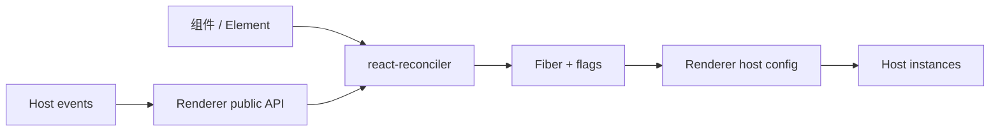
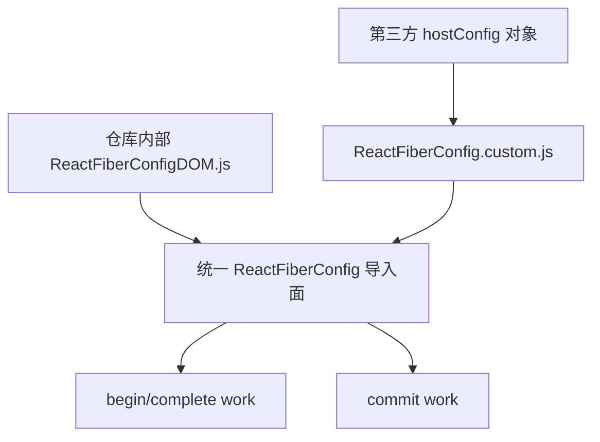
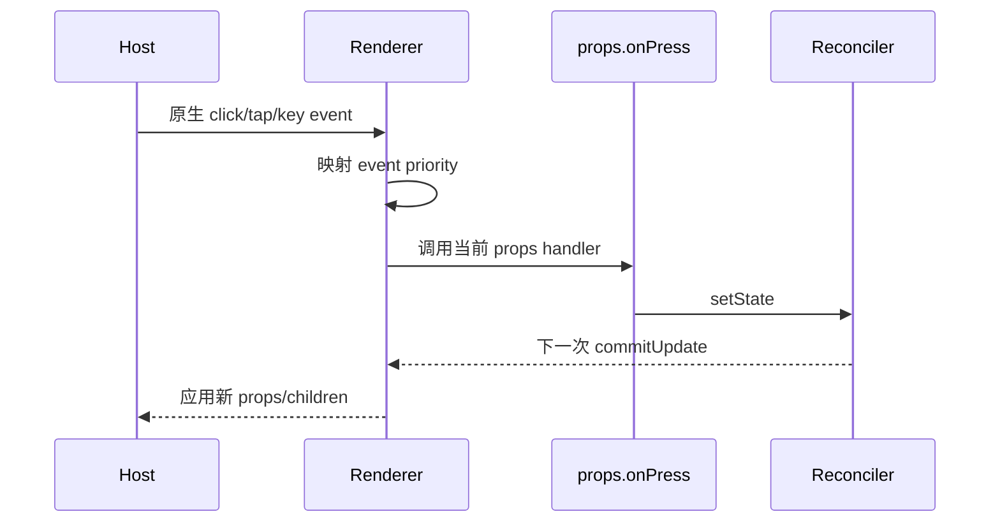

# Renderer：把 React 协调结果翻译成具体世界

## 用一个直观比喻理解 Renderer

可以把 React 分成“导演”和“舞台”：

- 组件与 JSX 写的是剧本。
- Reconciler 像导演，判断哪些角色保留、谁进场、谁退场。
- Fiber 是每个角色和场景的工作卡。
- Renderer 是舞台技术团队：它知道怎样造布景、移动道具、改灯光。
- Host 是真实舞台，例如 DOM、React Native、Canvas scene graph 或终端字符网格。

Reconciler 只发出“创建一个 `button`、把这段文字改成 `Save`、把节点移到另一个 child 前面”这样的抽象需求。Renderer 决定这些动作在目标平台意味着什么。

## 同一棵 React 树，不同现实

```jsx
function Status({online}) {
  return (
    <panel tone={online ? 'positive' : 'muted'}>
      <label>{online ? 'Online' : 'Offline'}</label>
    </panel>
  );
}
```

不同 renderer 可以把它解释为：

| Renderer | `panel` | `label` | 最终结果 |
| --- | --- | --- | --- |
| Web renderer | `<section>` | `<span>` | DOM 节点与 CSS 属性 |
| Native renderer | 原生 View | 原生 Text | iOS/Android view tree |
| Canvas renderer | scene group | text glyph node | 一张绘制场景 |
| Terminal renderer | 带边框区域 | 字符 cell | ANSI 终端界面 |
| JSON/test renderer | 普通对象 | 文本对象 | 可断言的内存树 |

React core 不规定 `panel` 是什么。自定义 renderer 定义 host type、props 语义和实例操作。

## 架构定位



Renderer 通常由四部分组成：

1. **Public API**：创建 root、更新 root、unmount、portal 等。
2. **Reconciler instance**：`Reconciler(hostConfig)` 的结果。
3. **Host config**：Reconciler 调用的能力契约。
4. **Host integration**：真实实例、事件、布局、绘制、资源和平台调度。

## Renderer 的职责

Renderer 负责：

- 定义 host type 与 props 的含义。
- 创建 host instance 与 text instance。
- 建立、排序、删除 child。
- 在 commit 中应用属性和文本变化。
- 暴露 ref 所看到的 public instance。
- 提供 host context，例如 HTML/SVG namespace。
- 对接 timeout、microtask、事件优先级和 DevTools host lookup。
- 按目标能力选择 mutation、persistence 和 hydration。
- 处理平台特有的 selection、资源、可见性、portal 等能力。

Renderer 不负责：

- 解析 JSX。
- 决定组件 key/type 身份规则。
- 实现 Hook 状态机。
- 重新实现 Lane 或 Scheduler。
- 随意读写 Fiber 内部字段；传给 host config 的 internal handle 应视为 opaque。

## 当前仓库中的 Renderer

### 面向产品的主要 renderer

| Renderer | 主要路径 | Host | 模式与说明 |
| --- | --- | --- | --- |
| React DOM | `packages/react-dom`、`packages/react-dom-bindings` | 浏览器 DOM | mutation + hydration；稳定公共产品面 |
| React Native classic | `packages/react-native-renderer` | Native UI Manager | 经典 mutation renderer |
| React Native Fabric | `packages/react-native-renderer` | Fabric shadow tree/native | persistence/新架构相关路径 |
| Fizz DOM | `packages/react-server` + `react-dom-bindings/server` | HTML stream | 服务端 renderer，不走客户端 mutation commit |
| Flight | `packages/react-server` / `react-client` | React model stream | 模型协议 renderer，不输出 DOM |

### 专用、测试或历史 renderer

| Renderer | 角色 | 证据边界 |
| --- | --- | --- |
| React Test Renderer | 内存测试树 | 已被标记 deprecated，不应作为新产品 renderer 模板的唯一依据 |
| React Noop Renderer | Reconciler 内部测试 host | 测试大量并发、Suspense 与 commit 语义，不是公共产品 |
| React ART | ART/vector host | 历史/专用 renderer，适合研究 host config 边界 |
| React Markup | 静态 markup 能力 | 服务端静态输出，不等同于通用客户端 renderer |

“仓库里有实现”不等于“它是稳定推荐 API”。自定义 renderer 的 `react-reconciler` 包本身明确标为 experimental，版本和 host config 都可能变化。

## Host config 是什么

第三方 `react-reconciler` bundle 把 host config 对象适配成 Reconciler 内部的 `ReactFiberConfig` 模块。仓库内部 renderer 直接导出同名函数；两者契约对应。



### 基础类型

先定义目标世界的数据模型：

```ts
type HostNode =
  | {kind: 'element'; type: string; props: object; children: HostNode[]}
  | {kind: 'text'; text: string};

type Container = {children: HostNode[]};
```

React 不要求实例一定是 DOM Node。它只要求 host config 的各函数对这些类型保持一致。

### 三种核心能力模式

| 能力 | 配置 | 工作方式 |
| --- | --- | --- |
| Mutation | `supportsMutation: true` | commit 时原地 append/insert/remove/update |
| Persistence | `supportsPersistence: true` | clone 变化路径，最后替换 root child set |
| Hydration | `supportsHydration: true` | 匹配并接管 host 中已有实例 |

Mutation 与 persistence 至少选择一种主模型。Hydration 是额外能力，不是所有 renderer 必需。

## Host config 的基础架构

### Render 阶段：构造尚未连接的候选实例

| Hook | 作用 |
| --- | --- |
| `getRootHostContext` | 从 root 取得 host context |
| `getChildHostContext` | 向 child 传播 namespace/环境 |
| `createInstance` | 创建 element host instance |
| `createTextInstance` | 创建 text instance |
| `appendInitialChild` | 组装尚未连接的候选子树 |
| `finalizeInitialChildren` | 初始 child 完成后的最后准备 |
| `shouldSetTextContent` | 是否让 parent 直接管理纯文本 |

Render 阶段可以修改刚创建、尚未连接的实例，但不能提前修改屏幕上的其他节点。候选工作可能被放弃。

### Commit 阶段：改变真实 host tree

Mutation renderer 的关键 hooks：

| Hook | 作用 |
| --- | --- |
| `prepareForCommit` | mutation 前保存全局 host 状态 |
| `appendChild` / `appendChildToContainer` | 插入 child |
| `insertBefore` / `insertInContainerBefore` | 插入或重排 |
| `removeChild` / `removeChildFromContainer` | 删除 host child |
| `commitUpdate` | 把 old/new props 差异应用到 instance |
| `commitTextUpdate` | 更新 text instance |
| `commitMount` | 实例确认连接后运行一次性逻辑 |
| `resetAfterCommit` | 恢复 selection 等 host 状态 |

### 时间与事件

| Hook/字段 | 作用 |
| --- | --- |
| `scheduleTimeout` / `cancelTimeout` / `noTimeout` | host timeout |
| `supportsMicrotasks` / `scheduleMicrotask` | root schedule 等 microtask 路径 |
| `setCurrentUpdatePriority` / `getCurrentUpdatePriority` | 保存 renderer 当前 update priority |
| `resolveUpdatePriority` | 把当前 host event 映射为 React event priority |
| `isPrimaryRenderer` | Context 的 primary/secondary renderer 角色 |

### 可选高级能力

Hydration、Suspense instance、Offscreen hide/unhide、resources、singletons、test selectors、fragments、View Transition 与 commit suspension 都有更大的 hook 集合。不要先复制空实现；先关闭不支持的 capability，并让类型/测试暴露真正必需项。

## 创建一个自定义 Renderer

下面以“内存场景树 renderer”为例。示例强调架构，不承诺跨 `react-reconciler` 版本直接复制可运行；应始终以当前版本的 `ReactFiberConfig.custom.js` 为完整契约。

### 第一步：定义 host 语义

```js
function elementNode(type, props) {
  return {kind: 'element', type, props, children: []};
}

function textNode(text) {
  return {kind: 'text', text};
}

function removeFromParent(parent, child) {
  const index = parent.children.indexOf(child);
  if (index >= 0) parent.children.splice(index, 1);
}
```

先回答具体问题：

- 哪些 type 合法？
- text 是否是独立节点？
- props 更新是覆盖还是 diff？
- child 可否移动？
- ref 应暴露内部对象还是安全 wrapper？

### 第二步：实现最小 mutation 语义

```js
import {
  DefaultEventPriority,
  NoEventPriority,
} from 'react-reconciler/constants';

let currentUpdatePriority = NoEventPriority;

const hostConfig = {
  rendererPackageName: 'react-memory-scene',
  rendererVersion: '0.1.0',
  isPrimaryRenderer: true,
  supportsMutation: true,
  supportsPersistence: false,
  supportsHydration: false,

  getRootHostContext() {
    return null;
  },
  getChildHostContext(parentContext) {
    return parentContext;
  },
  getPublicInstance(instance) {
    return instance;
  },

  createInstance(type, props) {
    return elementNode(type, props);
  },
  createTextInstance(text) {
    return textNode(text);
  },
  appendInitialChild(parent, child) {
    parent.children.push(child);
  },
  finalizeInitialChildren() {
    return false;
  },
  shouldSetTextContent() {
    return false;
  },

  prepareForCommit() {
    return null;
  },
  resetAfterCommit() {},

  appendChild(parent, child) {
    removeFromParent(parent, child);
    parent.children.push(child);
  },
  appendChildToContainer(container, child) {
    removeFromParent(container, child);
    container.children.push(child);
  },
  insertBefore(parent, child, beforeChild) {
    removeFromParent(parent, child);
    parent.children.splice(parent.children.indexOf(beforeChild), 0, child);
  },
  insertInContainerBefore(container, child, beforeChild) {
    removeFromParent(container, child);
    container.children.splice(
      container.children.indexOf(beforeChild),
      0,
      child,
    );
  },
  removeChild(parent, child) {
    removeFromParent(parent, child);
  },
  removeChildFromContainer(container, child) {
    removeFromParent(container, child);
  },
  commitUpdate(instance, type, oldProps, newProps) {
    instance.props = newProps;
  },
  commitTextUpdate(instance, oldText, newText) {
    instance.text = newText;
  },
  resetTextContent(instance) {
    instance.children = [];
  },

  scheduleTimeout: setTimeout,
  cancelTimeout: clearTimeout,
  noTimeout: -1,
  supportsMicrotasks: true,
  scheduleMicrotask: queueMicrotask,
  setCurrentUpdatePriority(priority) {
    currentUpdatePriority = priority;
  },
  getCurrentUpdatePriority() {
    return currentUpdatePriority;
  },
  resolveUpdatePriority() {
    return currentUpdatePriority !== NoEventPriority
      ? currentUpdatePriority
      : DefaultEventPriority;
  },
};
```

当前 host config 还要求一批 capability defaults、event priority、commit suspension、form、transition 等 hooks。应按当前 Flow 类型与 [`ReactFiberConfig.custom.js`](../../packages/react-reconciler/src/forks/ReactFiberConfig.custom.js) 补齐，而不是从旧博客复制一个短对象后假设兼容。

### 第三步：创建 Reconciler 与公共 root API

```js
import Reconciler from 'react-reconciler';
import {ConcurrentRoot} from 'react-reconciler/constants';

const reconciler = Reconciler(hostConfig);

export function createSceneRoot(container = {children: []}) {
  const root = reconciler.createContainer(
    container,
    ConcurrentRoot,
    null,
    false,
    null,
    '',
    console.error,
    console.error,
    console.error,
    () => {},
    null,
  );

  return {
    container,
    render(element) {
      reconciler.updateContainer(element, root, null, null);
    },
    unmount() {
      reconciler.updateContainer(null, root, null, null);
    },
  };
}
```

`createContainer` 的参数签名也是 experimental contract。封装在 renderer 自己的一个模块里，不要让应用到处直接调用。

### 第四步：观察一次更新

应用：

```jsx
root.render(
  <scene>
    <box color="blue">Hello</box>
  </scene>,
);
```

首次 render 后的内存 host tree：

```json
{
  "children": [
    {
      "kind": "element",
      "type": "scene",
      "children": [
        {
          "kind": "element",
          "type": "box",
          "props": {"color": "blue"},
          "children": [{"kind": "text", "text": "Hello"}]
        }
      ]
    }
  ]
}
```

再次 render 为 `<box color="red">Hi</box>` 时，Reconciler 复用兼容 Fiber/instance；renderer 收到 `commitUpdate` 与 `commitTextUpdate`，而不是销毁整个 container。

## 事件怎样回到 React

Renderer 不只输出 UI，还要把 host event 接回更新系统：



必须解决 handler 更新、事件批处理、离散/连续优先级、错误边界和卸载后事件清理。仅实现 create/append 只能证明静态示例，不是完整交互 renderer。

## 约定与工程检查单

### 正确性

- Render hooks 不修改已连接 host tree。
- Commit hooks 小而确定，插入操作可用于移动已有 child。
- `key`/type 身份由 Reconciler 管理，renderer 不另造冲突身份系统。
- ref 只暴露稳定 public instance。
- 删除能释放事件、资源和 native handles。

### 能力声明

- 只把真实支持的 `supports*` 设为 `true`。
- Mutation/persistence 行为和 hook 集合保持一致。
- 没有完整 marker/匹配/错误语义时不要声明 hydration。
- event priority 不要一律伪装成离散事件。

### 兼容与验证

- 锁定 `react`、renderer 与 `react-reconciler` 的兼容版本。
- 用 React Noop/DOM host config 研究当前行为，但不依赖未公开 Fiber 字段。
- 覆盖 mount、update、reorder、delete、text、ref、error、Suspense、unmount。
- 对交互 renderer 增加真实 host 端到端测试和长时间资源清理测试。
- 升级 Reconciler 时对 host config diff 做独立审查。

## 源码导航

- [`packages/react-reconciler/README.md`](../../packages/react-reconciler/README.md)：第三方 renderer 入口和基础 host config 说明。
- [`packages/react-reconciler/src/forks/ReactFiberConfig.custom.js`](../../packages/react-reconciler/src/forks/ReactFiberConfig.custom.js)：当前第三方 host config 完整 shim。
- [`packages/react-reconciler/src/ReactFiberConfig.js`](../../packages/react-reconciler/src/ReactFiberConfig.js)：内部统一 config 边界。
- [`packages/react-dom-bindings/src/client/ReactFiberConfigDOM.js`](../../packages/react-dom-bindings/src/client/ReactFiberConfigDOM.js)：DOM renderer 的完整实现。
- [`packages/react-native-renderer/src/ReactFiberConfigFabric.js`](../../packages/react-native-renderer/src/ReactFiberConfigFabric.js)：Fabric host config。
- [`packages/react-noop-renderer/src/ReactNoop.js`](../../packages/react-noop-renderer/src/ReactNoop.js)：内部测试 renderer。
- [`packages/react-reconciler/src/ReactFiberReconciler.js`](../../packages/react-reconciler/src/ReactFiberReconciler.js)：container/update 公共内部边界。

## 一句话总结

Renderer 是 React 与具体世界之间的翻译契约：Reconciler 决定逻辑变化，host config 把这些变化变成 DOM、Native、场景树或任意目标平台操作。
