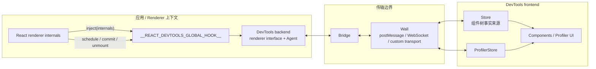
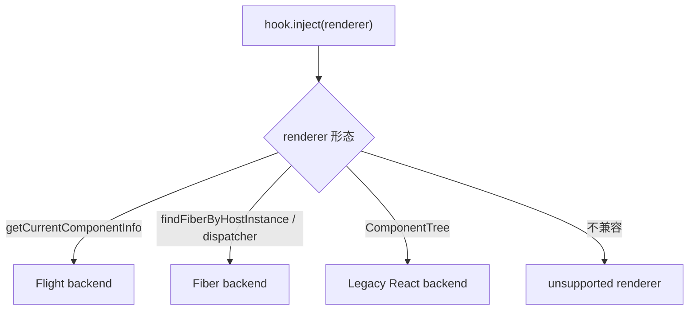
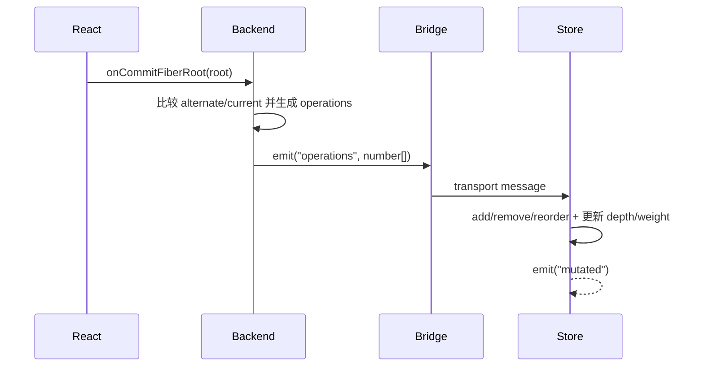
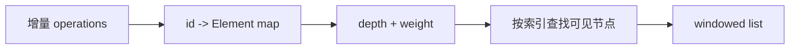
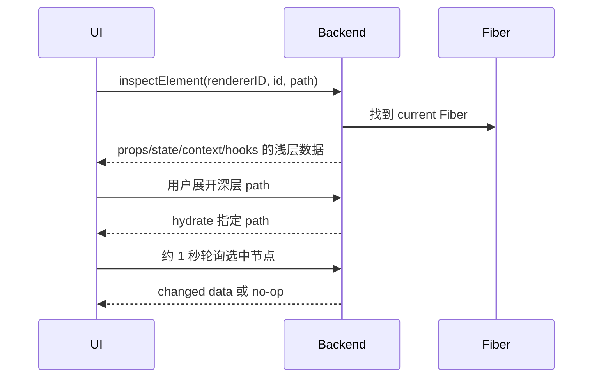

# React DevTools：跨 Renderer 的组件检查系统

## 定位

React DevTools 是一套观察和调试 React renderer 的系统，而不只是浏览器里的一个面板。它由运行在应用上下文中的 hook/backend、跨上下文 bridge，以及展示 Components/Profiler 的 frontend 组成。

它观察 Fiber renderer、Flight renderer 和历史 React renderer，并把不同实现转换成相对统一的组件树与检查协议。

## 它要解决什么问题

浏览器 Elements 面板只能看到 DOM，但 React 应用还包含：

- 不直接对应 DOM 的 function/class components。
- Hooks、Context、memoized state 和 owners。
- Suspense、Activity、Profiler 等逻辑节点。
- React Native 等没有浏览器 DOM 的 host。
- Server Components/Flight 产生的 component info。

DevTools 必须从 React renderer 获得逻辑树，同时避免每次 commit 都深度序列化全部 props/state，否则观察工具本身会显著拖慢应用。

## 总体架构



浏览器扩展、standalone React Native DevTools、inline DevTools 的外壳不同，但核心 backend、bridge、Store 和视图大量复用 `react-devtools-shared`。

## 第一层：全局 Hook

扩展需要尽早在页面中安装：

```js
globalThis.__REACT_DEVTOOLS_GLOBAL_HOOK__
```

它是 renderer 与 DevTools 的解耦点，提供事件 emitter、renderer registry 和 commit callbacks 等能力。

### Renderer 注入

Reconciler 初始化时，`ReactFiberDevToolsHook.injectInternals(internals)` 查找全局 hook，再调用：

```text
rendererID = hook.inject(rendererInternals)
```

`rendererInternals` 暴露版本、package name、Fiber/host 查找、覆盖 props/state、profiling hooks 等集成能力。Hook 给每个 renderer 分配 id，从而支持同一页面多个 renderer 和 root。

### 生命周期通知

Reconciler 在关键边界通知 hook：

- `onScheduleFiberRoot`：root 接收新 children。
- `onCommitFiberRoot`：一个 root 完成 commit。
- `onPostCommitFiberRoot`：passive effects 后的通知。
- `onCommitFiberUnmount`：Fiber 被卸载。

所有 instrumentation 调用都需要隔离异常，DevTools 故障不应破坏应用 commit。

## 第二层：Backend 与 Renderer Interface

Backend 运行在能访问 React/Fiber 对象的应用上下文中。`attachRenderer` 按 renderer 能力选择适配器：



Fiber backend 是主要实现，负责：

- 遍历 current Fiber tree 并给可见节点分配稳定 DevTools id。
- 应用 component filters，隐藏 host/高阶组件等用户不关心的层。
- 在 commit 时计算 add/remove/reorder 等树操作。
- 按需检查 props、state、context、hooks 和 source。
- 在支持时编辑 props/hooks/state、强制 error/Suspense、定位 host instance。
- 收集 profiler commit 数据与 change descriptions。

Backend 不把 Fiber 对象直接跨 bridge 传输。Fiber 有循环引用、内部字段且变化频繁，直接序列化既昂贵又不稳定。

## 第三层：Operations 协议

Components tree 的增量变化编码为数字数组：

```text
[rendererID, rootID, stringTableLength, ...stringTable, ...operations]
```

主要 operation 包括：

- add node。
- remove nodes。
- reorder children。
- update tree base duration。
- update error/warning counts。
- remove root。
- set subtree mode。

字符串先放进 string table，后续 operation 使用整数 id 引用。这样 display name/key 重复时无需反复传字符串。



大多数只改变 props/state、却不改变 DevTools 树结构的 commit 不需要发送完整节点数据。

## 第四层：Bridge 与 Wall

Bridge 是有版本的双向消息协议；Wall 抽象真实传输：

- 浏览器扩展中的 `postMessage`/extension port。
- standalone 与 React Native 的 WebSocket。
- embedder 提供的 custom messaging protocol。

Bridge 负责事件队列、发送/监听、shutdown 和 protocol compatibility。协议记录前后端支持版本，检测不兼容时让 frontend 显示升级/降级提示。

Bridge 传的是可序列化消息，不应假定双方共享 JavaScript heap。

## 第五层：Frontend Store

Frontend Store 是 Components panel 的事实来源。它从 operations 重建一棵轻量树，节点保存：

- `id`、`parentID`、`children`。
- `type`、`displayName`、`key`、`ownerID`。
- `depth`：展示缩进。
- `weight`：含自身的可见子树大小。

UI 不把整棵树渲染成巨大嵌套 DOM，而是把树映射成扁平可见序列并窗口化。`weight` 让 Store 能较快找到“第 N 个可见节点”。



## 为什么 props/state 按需获取

树同步只传 name/type/key 等最少信息。用户选中节点后，frontend 才发送 `inspectElement`：



这里 DevTools 的 `dehydrate` 是**为 bridge 序列化而裁剪深层数据**，与 React DOM Hydration 完全无关。

Backend 记住用户展开的 paths，后续轮询不会再次裁剪它们。若节点自上次 inspect 后没有更新，可返回 no-op，减少序列化。

## Hooks 是怎样被检查的

Hook 状态按调用位置存在 Fiber 链表里，但 custom Hook 层级不直接存成完整命名树。`react-debug-tools` 的策略概括为：

1. 临时替换 Hook dispatcher。
2. 对目标 function component 做 shallow render。
3. 记录每个 built-in Hook 调用。
4. 解析调用栈，推断 component 与 built-in Hook 之间的 custom Hooks。
5. 把记录和值组织成可显示的 Hook tree。

这是一次额外 render，因此可能命中断点。实现会限制为选中且确实使用 Hook 的组件、节流检查，并临时抑制 console 噪声。它仍然是观察者开销的一部分。

## Host 元素定位

Renderer internals 提供 Fiber 与 host instance 的双向查找。DevTools 用它支持：

- 从组件高亮 DOM/Native host。
- 从页面点选 host 后定位最近 Fiber。
- 滚动到 host。
- 在浏览器内建 Elements panel 与 Components panel 间同步。

这是 renderer-specific capability；一个没有几何或 DOM 的自定义 renderer 可以只实现合理子集。

## 编辑与强制状态

Frontend 的编辑请求通过 bridge 到 backend，再调用 renderer internals：

- override props。
- override Hook state。
- override class state/context。
- force error。
- force Suspense fallback。

这些是调试 mutation，会触发 renderer 更新；不是直接编辑 JSX 源码，也不保证刷新后持久化。生产构建可能关闭部分能力。

## 部署形态

| 形态 | Frontend 在哪里 | Backend 在哪里 | Transport |
| --- | --- | --- | --- |
| 浏览器扩展 | DevTools panel | inspected page | extension messaging / page proxy |
| Standalone | Electron/独立窗口 | app/runtime | WebSocket |
| Inline | 应用自带 UI | 同页或指定 target | inline wall |
| React Native 集成 | DevTools app | Hermes/native app runtime | RN messaging/WebSocket |

不同壳层的注入时机和安全边界不同，但都必须先让 hook 在 renderer 初始化前可见。

## 性能设计

DevTools 的主要减负策略：

- commit 只发送组件树需要的增量 operations。
- props/state/hooks 按选择和展开路径惰性获取。
- 深层数据 dehydration。
- frontend tree windowing。
- profiling 大数据尽量留在 backend，停止后再传。
- 图表派生数据惰性计算和缓存。

因此“打开 DevTools 没有开销”不成立；更准确的结论是实现主动压低 CPU、bridge、内存和渲染开销。性能测量仍应比较 DevTools 开/关两种样本。

## 常见误解

### “DevTools 直接读取 DOM 推回组件树”

逻辑树主要来自 renderer/Fiber 注入。DOM 只用于 host 定位与高亮。

### “每次 commit 都把全部 Fiber 发给面板”

Backend 发送紧凑增量 operations，详情按需 inspect。

### “DevTools 的组件 id 就是 Fiber 地址”

Backend 管理稳定的逻辑 id 映射；不能把它当作公开 Fiber identity 或跨 session 持久 id。

### “Hook 面板读取 Fiber 就能知道所有 custom Hook 名称”

custom Hook tree 需要额外 dispatcher instrumentation 与 stack parsing。

## 源码导航

- [`packages/react-devtools/OVERVIEW.md`](../../packages/react-devtools/OVERVIEW.md)：官方仓库内 Components/Profiler 架构说明。
- [`packages/react-devtools-shared/src/hook.js`](../../packages/react-devtools-shared/src/hook.js)：全局 hook、renderer registry 与 commit 事件。
- [`packages/react-reconciler/src/ReactFiberDevToolsHook.js`](../../packages/react-reconciler/src/ReactFiberDevToolsHook.js)：Reconciler 注入和通知边界。
- [`packages/react-devtools-shared/src/attachRenderer.js`](../../packages/react-devtools-shared/src/attachRenderer.js)：Fiber/Flight/legacy backend 选择。
- [`packages/react-devtools-shared/src/backend/fiber/renderer.js`](../../packages/react-devtools-shared/src/backend/fiber/renderer.js)：Fiber backend 主实现。
- [`packages/react-devtools-shared/src/bridge.js`](../../packages/react-devtools-shared/src/bridge.js)：双向消息与协议版本。
- [`packages/react-devtools-shared/src/devtools/store.js`](../../packages/react-devtools-shared/src/devtools/store.js)：frontend 组件树 Store。
- [`packages/react-debug-tools/src/ReactDebugHooks.js`](../../packages/react-debug-tools/src/ReactDebugHooks.js)：Hook 检查。
- [`packages/react-devtools-extensions/src`](../../packages/react-devtools-extensions/src)：浏览器扩展注入与 panel 外壳。

## 一句话总结

React DevTools 是一套 renderer instrumentation 协议：global hook 捕获 renderer 生命周期，backend 把 Fiber 转成最小增量，bridge 跨上下文传输，frontend Store 重建并按需检查组件。

