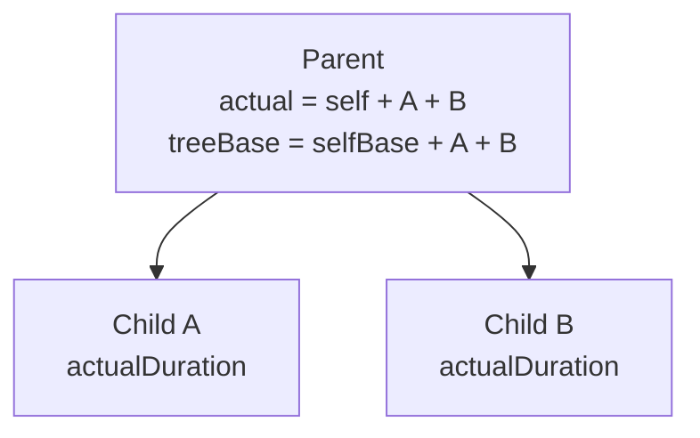
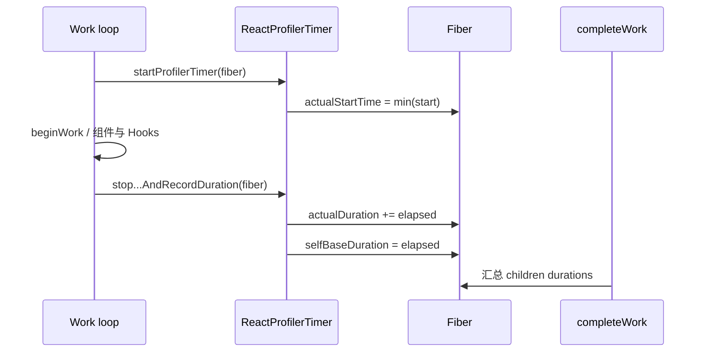
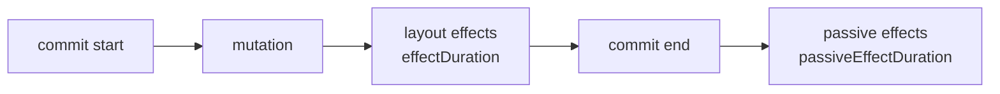
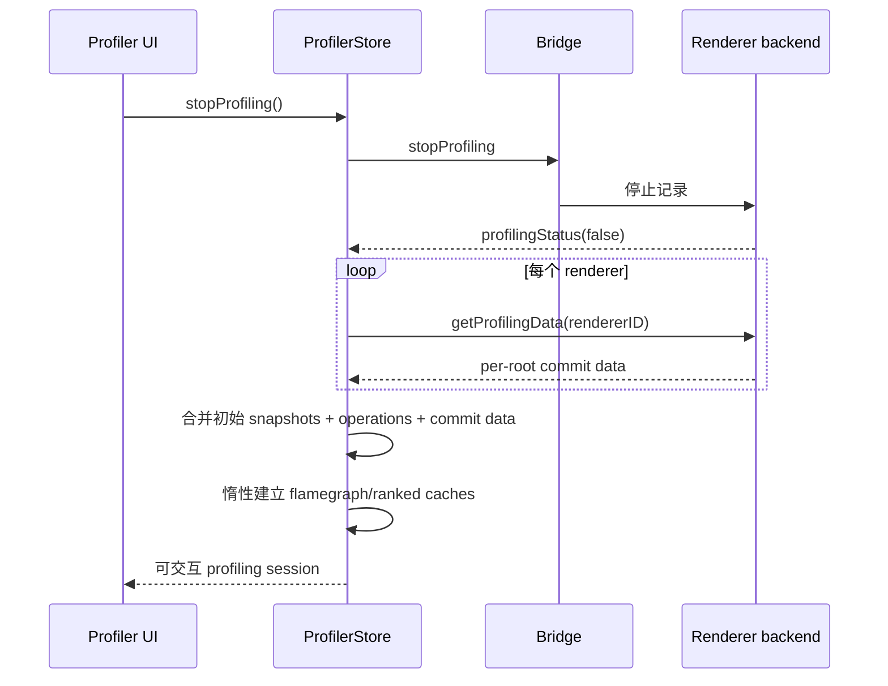
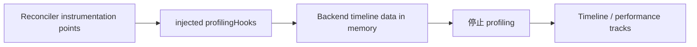

# Profiler：React 运行时插桩与性能数据管线

## 名称边界

“Profiler”在 React 中至少指三层能力：

1. `<Profiler>`：应用可放入树中的 React component type，通过 callback 获得子树 render/commit effect 时长。
2. DevTools Profiler：记录多个 root/commit、重建树并展示 flamegraph、ranked 等视图。
3. Timeline / performance tracks：通过 Reconciler profiling hooks 记录 schedule、render、commit、effect、Suspense 等时间事件。

它们共享部分 runtime instrumentation，但 API、数据粒度与消费者不同。

## 第一性原理：测量必须发生在运行时

React Compiler 可以静态分析依赖，却不能知道某台设备上某次组件调用实际花了多久。Profiler 因此在 Reconciler 的真实 render/commit 路径加入计时点：

- 工作开始时读 `Scheduler.unstable_now()`。
- 工作结束时计算 elapsed time。
- 把结果写到 Fiber 或当前 commit 的 profiling state。
- Complete/commit 时聚合并通知消费者。

Instrumentation 本身会增加计时、内存和回调开销，因此 profiling build/feature flags 与惰性数据处理很重要。

## Runtime 数据模型

启用 profiler timer 时，Fiber 包含：

| 字段 | 含义 |
| --- | --- |
| `actualDuration` | 本次更新中该 Fiber 子树实际执行工作的累计时长 |
| `actualStartTime` | 本次子树工作最早开始时间 |
| `selfBaseDuration` | 最近一次完整 render 中该 Fiber 自身估算时长 |
| `treeBaseDuration` | 不考虑 memo bailout 时，整棵子树的基线 render 成本 |

work-in-progress 创建时通常重置 `actualDuration` / `actualStartTime`，但复制 base durations。`completeWork` 向父 Fiber 汇总 child actual/base duration。



`treeBaseDuration` 不是每次真实耗时，也不是用户端到端延迟；它用于表达“如果这棵树都需要 render，大约有多少 React render 成本”。

## Render 计时机制



如果 work suspend、报错、重做或多 pass，计时函数有 incomplete/transfer 等专用路径，避免把不完整工作错误写成稳定 base duration，或丢失应计入的多 pass 成本。

Concurrent render 的 `actualDuration` 可以包含分散在多个 host callback 中的实际 React 工作，但不应直接解释为连续阻塞主线程的墙钟区间。

## `<Profiler>` 如何工作

用法：

```jsx
<Profiler
  id="ProductGrid"
  onRender={handleRender}
  onCommit={handleCommit}>
  <ProductGrid />
</Profiler>
```

`Profiler` 是特殊 React type，对应 Profiler Fiber。进入这棵子树时开启 `ProfileMode`；commit 时读取该 Fiber 聚合后的 duration。

### `onRender`

核心参数：

```text
onRender(
  id,
  phase,
  actualDuration,
  baseDuration,
  startTime,
  commitTime
)
```

| 参数 | 含义 |
| --- | --- |
| `id` | 用户给 Profiler 的标识 |
| `phase` | `mount`、`update`，特定构建可有 `nested-update` |
| `actualDuration` | 本次该子树实际 render 工作 |
| `baseDuration` | 该子树最近基线成本 |
| `startTime` | 本次 render 工作最早开始 |
| `commitTime` | 这一批 commit 的共享时间 |

同一次 commit 中多个 Profiler 的 `commitTime` 相同，可用于分组，而不能用来推断网络请求开始时间。

### Commit effect callbacks 的稳定性边界

- 当前 `ProfilerProps` 类型包含可选的 `onCommit(id, phase, effectDuration, commitTime)`，用于 layout/class commit effects 的 duration；它受 `__PROFILE__`/`enableProfilerCommitHooks` 构建能力约束。
- Commit 源码还存在 `onPostCommit(id, phase, passiveEffectDuration, commitTime)` 路径，用于 passive effects，但它不在当前 `ProfilerProps` 公开类型中，应视为内部 instrumentation，而不是应用可依赖的稳定 API。

应用不应在 profiling callback 中执行重任务，否则测量工具会成为新瓶颈。跨发布渠道使用前，还应核对目标 build 是否真正包含对应 profiling 支持。

## Commit 计时

`recordCommitTime`、`recordCommitEndTime` 记录 commit 窗口。Effect 执行前 `startEffectTimer`，结束后 `recordEffectDuration` 把时长累计到最近 Profiler ancestor 或 root。



Mutation、layout、passive 是不同语义段。只看 `actualDuration` 会漏掉昂贵 layout/passive effect。

## DevTools Basic Profiler 架构

### 开始记录

Frontend `ProfilerStore`：

1. 清空上次数据。
2. 保存每个 root 的初始轻量树 snapshot。
3. 保存当前 renderer ids。
4. 通过 bridge 发送 `startProfiling`。
5. 等 backend 回报 `profilingStatus`，避免 UI 状态与真实记录窗口错位。

### 记录期间

Backend 按 root 保存 commit metadata：

- commit time/duration。
- rendered fiber ids 与 actual durations。
- priority / lanes 相关信息。
- effect durations。
- 可选 change descriptions。
- tree base durations。

Frontend 同时保留每次 commit 对应的 `operations`。这是重建历史树所需的增量日志。

### 停止与合并



大量数据在 profiling 停止后才跨 bridge，降低记录期间的观察者干扰。Frontend 合并后的结构可导出/导入 JSON。

## 历史树如何重建

Profiler 不能只保存“现在的树”，因为用户会点击过去的 commit。它使用：

```text
初始 root snapshot
  + commit 1 operations
  + commit 2 operations
  + ...
  = 任意 commit 时刻的组件树
```

这也是 operations 与 commit metadata 必须对齐的原因；profiling 时即使某次没有普通树 mutation，也要维持对应关系。

## Timeline / Scheduling Profiler

DevTools backend 创建 `profilingHooks` 并通过 renderer internals 的 `injectProfilingHooks` 注入 Reconciler。Reconciler 在 feature flag 开启时调用：

- mark render/commit/layout/passive start/stop。
- mark component render/errored/suspended。
- mark state update scheduled、force update、ping。
- mark Suspense、Transition、yield 等事件。



这比 `<Profiler>` callback 更接近全局调度时间线，但仍是 React instrumentation 视角。浏览器 CPU sample、network、style/layout/paint 需要浏览器 Performance trace 才能完整关联。

## Performance tracks

当前 runtime 还记录 blocking、Transition、gesture、retry、idle、effect、animation 等 track 所需时间和原因。它会把：

- 事件时间。
- 首次 update 时间与方法。
- suspend/yield 窗口。
- render/commit/effect 时间。
- spawned/pinged update。

组织为更贴近一次用户交互因果链的数据。

这些数据是 instrumentation evidence，不能自动证明某个组件是业务根因。例如慢 commit 可能来自 renderer host mutation、layout effect 或浏览器布局，而不只是某个 `actualDuration` 较高的 function component。

## 如何正确读 Profiler

### Flamegraph

回答“选定 commit 中，哪些已 render 子树占用较多 React render 时间”。宽/颜色的具体映射由 UI 版本决定。

### Ranked

按组件 render cost 排序，适合找该 commit 中昂贵节点，但会弱化父子因果关系。

### Why did this render / change descriptions

可选记录 props、state、context 等变化。启用会增加记录与比较开销，而且只能说明值变化，不等于证明变化不必要。

### Commit 选择

先找用户感知慢的交互对应 commit，再看：

1. render actual duration。
2. base duration 与 bailout 效果。
3. commit/layout/passive effect。
4. commit 频率和 nested/spawned updates。
5. 浏览器主线程、layout/paint/network 的外部证据。

## 测量边界

| 声明 | 最低所需证据 |
| --- | --- |
| 某 Fiber 在一次 commit render 较慢 | Profiler actualDuration，可标为 `component` |
| 某次 React commit 较慢 | commit/effect profiling，可标为 `component` |
| 某交互端到端较慢 | 输入到 paint 的 browser trace，可标为 `end_to_end` |
| 优化后稳态更省资源 | 相同负载长时间 CPU/内存/commit 数据，可标为 `soak` |
| 线上用户改善 | 生产 RUM/trace，可标为 `production` |

开发构建、StrictMode 重复调用和 DevTools 自身都会影响数值。比较前必须固定 build、设备、输入、采样窗口和 DevTools 状态。

## 常见误解

### “`actualDuration` 就是用户等待时间”

它是 React render work 的累计计时，不包含或不等同于排队、网络、浏览器 layout/paint 与所有 host 工作。

### “baseDuration 是没有 memo 时的精确预测”

它由最近完整 render 的 Fiber self durations 汇总，是有用估算，不是对未来每次执行的保证。

### “Profiler 数据零开销”

计时读取、Fiber 字段、记录与 bridge 都有成本。实现通过 flags、backend retention 和 lazy computation 降低影响。

### “一条 profile 足以证明一般性能”

单次样本只能描述该输入和环境。一般化需要重复样本、分布、兼容路径与 soak。

## 源码导航

- [`packages/react-reconciler/src/ReactProfilerTimer.js`](../../packages/react-reconciler/src/ReactProfilerTimer.js)：render、commit、effect 与 performance track 计时状态。
- [`packages/react-reconciler/src/ReactFiber.js`](../../packages/react-reconciler/src/ReactFiber.js)：Fiber profiling 字段初始化与 work-in-progress 复制规则。
- [`packages/react-reconciler/src/ReactFiberCompleteWork.js`](../../packages/react-reconciler/src/ReactFiberCompleteWork.js)：actual/base duration 冒泡。
- [`packages/react-reconciler/src/ReactFiberCommitEffects.js`](../../packages/react-reconciler/src/ReactFiberCommitEffects.js)：`onRender`、`onCommit`、`onPostCommit`。
- [`packages/react-reconciler/src/ReactFiberDevToolsHook.js`](../../packages/react-reconciler/src/ReactFiberDevToolsHook.js)：timeline profiling hooks 注入和 markers。
- [`packages/react-devtools-shared/src/backend/profilingHooks.js`](../../packages/react-devtools-shared/src/backend/profilingHooks.js)：DevTools timeline 数据收集。
- [`packages/react-devtools-shared/src/backend/fiber/renderer.js`](../../packages/react-devtools-shared/src/backend/fiber/renderer.js)：per-root commit profiling data。
- [`packages/react-devtools-shared/src/devtools/ProfilerStore.js`](../../packages/react-devtools-shared/src/devtools/ProfilerStore.js)：recording 状态、snapshot/operations 与数据合并。
- [`packages/react-devtools-shared/src/devtools/ProfilingCache.js`](../../packages/react-devtools-shared/src/devtools/ProfilingCache.js)：图表派生数据惰性缓存。
- [`packages/react/src/__tests__/ReactProfiler-test.internal.js`](../../packages/react/src/__tests__/ReactProfiler-test.internal.js)：Profiler callbacks 与嵌套语义测试。

## 一句话总结

Profiler 是一条从 Fiber runtime 计时、commit/effect 插桩，到 DevTools backend 记录和 frontend 重建图表的数据管线；它测量 React 工作，但不能替代浏览器端到端性能证据。
