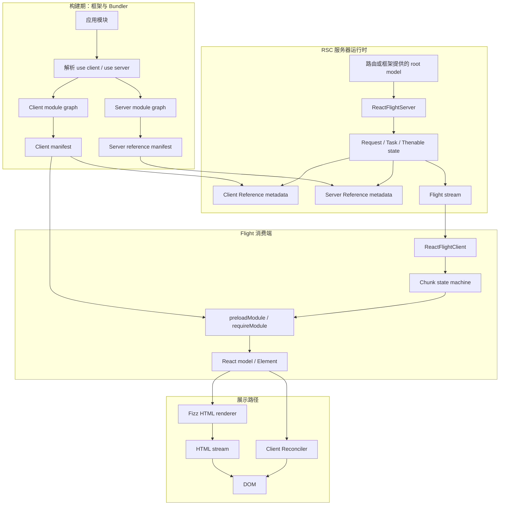
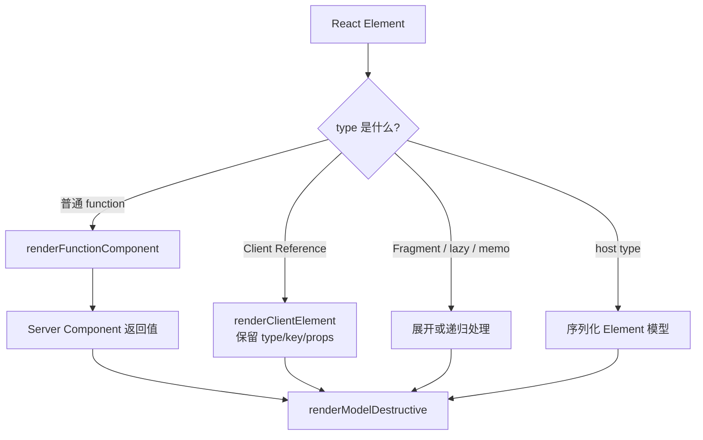
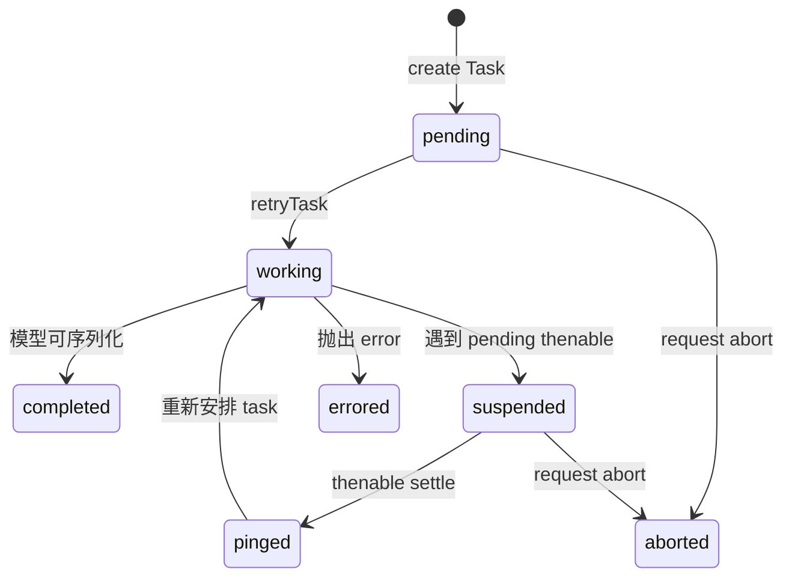
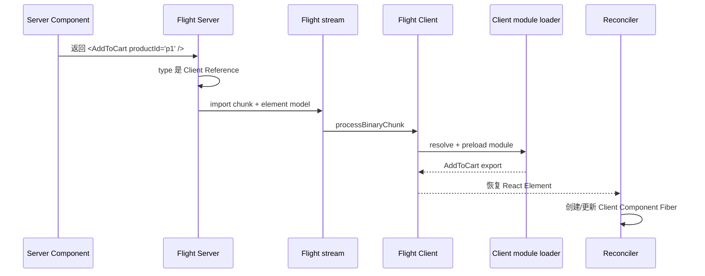
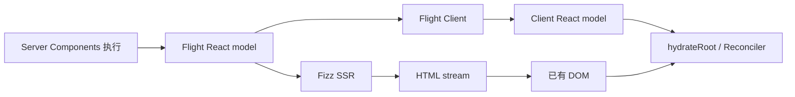
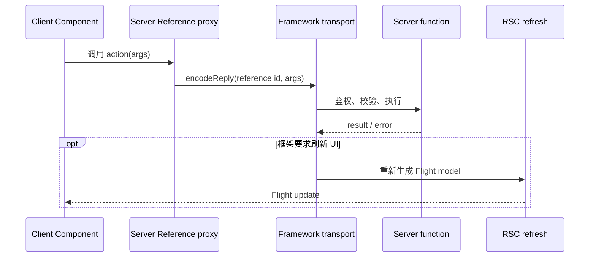

# React Server Components：服务器组件模型与 Flight 边界

## 定位

React Server Components（RSC，React 服务器组件）是一种把部分组件固定在服务器执行、再把其结果以 React 模型发送给消费者的架构。

RSC 的核心价值不是“在服务器生成 HTML”，而是：

- 让组件在服务器读取数据库、文件或内部服务。
- 不把这些 Server Component 的实现代码发送到浏览器。
- 保留 React Element、Suspense、组件引用和异步值等模型语义。
- 让服务器结果与浏览器中的 Client Components 组合成一棵 React UI。

RSC 的传输协议是 Flight。RSC 只产生模型，不直接产生 HTML；Fizz 才是 HTML renderer。

## 先区分四个容易混淆的概念

| 概念 | 执行位置 | 主要输出 | 关键边界 |
| --- | --- | --- | --- |
| Server Component | RSC 服务器环境 | 被归约后的 React 模型 | 实现代码不进入客户端 bundle |
| Client Component | 浏览器；也可参与预渲染表示 | 可交互 Element/Fiber 子树 | 可使用 state、effects 和浏览器 API |
| Fizz SSR | 服务器 | HTML stream | 优化首屏内容，不定义模块图边界 |
| Server Reference / Action | 函数在服务器执行 | 可序列化的调用引用 | 需要框架提供 transport、鉴权和调用入口 |

最重要的名称规则：

- `"use client"` 声明 Client Component 模块边界。
- `"use server"` 声明可从边界外调用的 Server Reference。
- **Server Component 不靠 `"use server"` 指令定义。**它是否属于服务器组件图，由框架、bundler 和 `react-server` 条件决定。

## 一张完整架构图



图中的 manifest、路由、stream transport 和部署组合主要属于框架/bundler；React core 提供模型执行、引用与编解码机制。

## 为什么不能只传 HTML

假设服务器组件返回：

```jsx
async function ProductPage({id}) {
  const product = await db.products.find(id);
  return (
    <ProductLayout>
      <Price value={product.price} />
      <AddToCart productId={id} />
    </ProductLayout>
  );
}
```

如果只传 HTML：

- 浏览器可以显示价格。
- 但无法知道 `AddToCart` 对应哪个客户端模块。
- 无法保留 Promise、lazy、引用和 React tree 的组合语义。
- 后续导航通常只能重新下载整页 HTML，或另造一套 JSON 到组件映射。

Flight 模型可以同时表示：

- 已在服务器算好的 `Price` 输出。
- `AddToCart` 的 Client Reference。
- props、key、Promise 和错误。
- 服务器可调用函数的 Server Reference。

因此 RSC 不是“HTML 模板”，而是 React 模型的服务器求值与传输层。

## 构建期：怎样切分模块图

### `"use client"`

一个 Client Component 模块示例：

```jsx
'use client';

import {useState} from 'react';

export function AddToCart({productId}) {
  const [pending, setPending] = useState(false);
  // ...
  return <button disabled={pending}>Add to cart</button>;
}
```

Bundler integration 需要：

1. 识别模块顶部 directive prologue 中的 `"use client"`。
2. 把模块及其客户端依赖放进 client module graph。
3. 为每个可引用 export 生成 module id、export name 和 chunk 信息。
4. 在 server graph 中用 Client Reference proxy 代替真实客户端实现。
5. 生成 Flight Server 与 Flight Client 都能解释的 manifest。

当前 Webpack Node register 示例会把 client module 替换为 `createClientModuleProxy(moduleId)`。Proxy 的 export 带有：

```text
$$typeof = Symbol.for('react.client.reference')
$$id     = module id + export name
$$async  = module 是否异步
```

Server Component 可以把这个引用作为 Element type 或 prop 继续传递，但不能在服务器把它当普通客户端函数调用。

### `"use server"`

Webpack register 看到 `"use server"` 模块时，会执行服务器模块，并对导出的函数调用 `registerServerReference`。引用包含：

```text
$$typeof = Symbol.for('react.server.reference')
$$id     = module id + export name
$$bound  = 已绑定参数或 null
```

Flight 可以把 id 和 bound arguments 发送给客户端。客户端触发时，框架再把调用送回服务器。

这不是“把函数代码序列化到浏览器”，也不是“自动安全的 RPC（远程过程调用）”。

### 传递性

`"use client"` 通常建立模块图边界：从该模块静态导入的运行时代码也必须能进入客户端图。它不表示文件中的每个值都会自动发送到浏览器；实际 bundle 仍受 bundler 分析与框架规则影响。

Server Component 可以 import Client Component 并渲染其引用。Client Component 不应通过普通 client module import 直接拉入 Server Component 实现；常见组合方式是由服务器先创建 Server Component children，再通过 `children` 或其他 slot prop 传给 Client Component。

## 服务器运行时：Server Component 怎样执行

### 1. 创建 Flight Request

框架/adapter 调用 Flight Server 入口，概念顺序为：

```text
createRequest(model, bundlerConfig, options)
startWork(request)
startFlowing(request, destination)
```

Request 持有：

- 下一个 chunk id。
- pending/abortable tasks。
- completed model/import/error/hint chunks。
- bundler config 与 temporary references。
- per-request cache、identifier prefix 和 debug/profiling 信息。
- error、postpone、hint 等 callbacks。

### 2. Task 执行 Element

`renderElement` 查看 Element type：

- 普通 function 且不是 Client Reference：作为 Server Component 调用。
- Client Reference：不调用实现，序列化为 terminal client element。
- Fragment、lazy、memo、forwardRef 等：进入对应模型逻辑。
- host type：作为 React Element 模型继续序列化，供后续 renderer 解释。



Server Component 本身不会作为需要在客户端执行的 Fiber 节点发送。它被服务器调用，其返回值继续归约，直到剩下客户端可消费的模型边界。

### 3. Server Hooks Dispatcher

Flight Server 安装自己的 Hooks dispatcher。当前支持边界包括：

- `use`：读取 thenable；pending 时 suspend task。
- `useId`：生成带 request prefix 的服务器 id。
- `useMemo`：在当前执行中计算值。
- `useCallback`：返回 callback 自身。
- server cache/async dispatcher 相关能力。

当前不支持的典型 Hooks：

- `useState`、`useReducer`。
- `useEffect`、`useLayoutEffect`、`useInsertionEffect`。
- `useRef`。
- `useTransition`、`useDeferredValue`。
- 读取 Client Context。

原因不是语法限制，而是生命周期不匹配：Server Component 是一次服务器求值，没有浏览器中的持久组件实例、交互状态或 commit effect 生命周期。

### 4. Suspend、Ping 与 Retry

Server Component 可以是 async function，也可以通过 `use` 读取 Promise：



Task suspend 时不会要求整个 response 一起等待。已完成 chunks 可以先流出，Promise 对应的模型在后续 chunk 完成。这是 RSC 与 Suspense/streaming 协作的基础。

## Flight Server 序列化什么

当前实现支持的不只是普通 JSON：

| 类别 | 示例 |
| --- | --- |
| primitives | string、boolean、number、`undefined`、BigInt |
| React 模型 | Element、Fragment、lazy reference、key/owner debug info |
| 引用 | Client Reference、Server Reference、temporary reference |
| 异步 | Promise/thenable、ReadableStream、AsyncIterable |
| 集合与数据 | plain object、Array、Map、Set、FormData |
| 二进制 | ArrayBuffer、typed arrays、DataView、Blob |
| 特殊值 | Date、global `Symbol.for(...)`、Error |

这是当前源码能力，不代表任意 class instance、closure 或平台对象都能跨边界。

### 不能直接跨边界的典型值

- 自定义 class instance 或带方法的复杂对象。
- 非全局 Symbol。
- 任意 function。
- Server Component 中的 event handler。
- ref。
- 含不可序列化属性的对象。

普通 function 只有被明确注册为 Server Reference 后才能作为函数引用传递。Client Component event handler 必须由客户端模块定义，而不是从 Server Component 直接把 closure 传过去。

### 序列化是一条 API 契约

Server Component 给 Client Component 的 props 本质上是跨运行时协议输入。设计 props 时应优先：

- 小而稳定的 plain data。
- 明确 id 而不是数据库实体实例。
- 可版本化的 discriminated union。
- 不包含 secret、连接对象或服务器 closure。

## Client Reference 的工作机制

当 Flight Server 遇到 Client Reference：

1. 通过 bundler config 解析 reference metadata。
2. 首次出现时分配 import chunk id。
3. Element type 位置可使用 lazy reference，让客户端等待模块而不阻塞更高层模型。
4. Flight stream 发送 module id、chunks 和 export name。

Flight Client 随后：

1. 解析 import row。
2. 用 client manifest 执行 `resolveClientReference`。
3. 调用 `preloadModule`。
4. 模块就绪后调用 `requireModule` 获得 export。
5. 让依赖该模块的 model Chunk 从 blocked 进入 fulfilled。



客户端拿到的是 Client Component 的模块实现；Server Component 的实现已经在服务器执行完，不需要下载。

## Flight Client：从 Row 到 React 模型

Flight Client 为每个 row id 管理 Chunk 状态：

```text
pending
  -> resolved_model
  -> resolved_module
  -> blocked
  -> fulfilled
  -> rejected
```

模型初始化可能发现它依赖另一个尚未到达的 Chunk 或尚未加载的 module，于是进入 blocked。依赖完成后，Chunk 再继续初始化。

Chunk 实现 thenable 语义，Client Reconciler 可以通过 `use`/Suspense 等路径等待它，而不是要求网络 response 完整结束后再开始消费。

## RSC、SSR 与 Hydration 的关系

### RSC 不等于 SSR



- RSC 回答“哪些组件在服务器求值，怎样把结果保留为 React 模型”。
- SSR 回答“怎样把 React tree 转成首屏 HTML”。
- Hydration 回答“怎样让客户端 Fiber 接管已有 DOM”。

框架的初始请求可以同时产生 HTML 与内嵌/并行 Flight 数据。后续导航也可以只请求 Flight 模型，再让 Client Reconciler 更新现有 UI。

### 状态能否保留

Flight 更新被恢复为新的 React Element 输入。Client Component 状态是否保留仍由 Reconciler 的父位置、key 和 type 身份规则决定，不是“来自服务器”就必然重置或保留。

Server Component 自身没有客户端 Hook state 可保留；它每次请求/刷新是新的服务器求值。

## Server Components 与 Client Components 怎样组合

### 推荐：把交互限制在叶子或清晰边界

```jsx
// Server Component
async function ProductPage({id}) {
  const product = await loadProduct(id);
  return (
    <ProductDetails product={toClientProduct(product)}>
      <AddToCart productId={id} />
    </ProductDetails>
  );
}
```

- 数据读取与不可交互结构留在服务器。
- 需要 state/event/browser API 的最小区域使用 Client Component。
- 传入客户端的数据显式裁剪。

### 推荐：用 slot 让服务器内容穿过客户端边界

```jsx
// Server Component
<ExpandablePanel>
  <ServerRenderedDetails id={id} />
</ExpandablePanel>
```

`ExpandablePanel` 可以是 Client Component，只管理展开状态；`children` 模型由服务器提前创建并作为 prop 传入。客户端模块不需要 import `ServerRenderedDetails` 实现。

### 谨慎：过大的 Client boundary

如果在高层布局标记 `"use client"`，其客户端依赖图可能扩大，降低“不发送服务器组件实现”的收益。应根据真实 bundle、交互与导航 profile 决定边界，而不是机械追求最小或最大数量。

## Cache 与请求边界

Server Components 经常直接读数据，因此 cache ownership 必须清楚：

- React request cache 用于同一 request 中的资源复用。
- 框架可能增加跨 request data cache、route cache 或 CDN。
- 数据库/服务端 SDK 自己也可能缓存。

个性化资源的 cache key 必须覆盖用户、租户、权限、locale、版本等变体。不能因为组件只在服务器执行，就假设全局缓存天然安全。

Cache invalidation、revalidation 和 navigation refresh 主要由框架定义；React core 不知道业务数据何时失效。

## Server Reference / Action 不是 RSC 的同义词



RSC 是服务器组件模型；Server Action 是客户端请求服务器函数调用的能力。Action 完成后是否触发 RSC refresh、cache invalidation 或 redirect 由框架协议决定。

## 安全边界

### “只在服务器执行”不等于“输出自动保密”

以下内容可能进入 Flight payload：

- 传给 Client Component 的 props。
- Server Component 返回的文本和值。
- 开发模式 debug 信息。
- Server Reference 的 id 与绑定参数。
- 生产错误 digest 等框架允许的数据。

不得把 secret、数据库凭据、内部 authorization object 或不必要的个人数据传入可序列化模型。

### 每次数据读取与 Action 都要授权

模块位于 server graph 只证明代码位置，不证明调用者权限。必须在数据访问/Action 边界根据服务器可信身份校验：

- 用户与 tenant。
- 资源 ownership。
- role/permission。
- 输入 schema。
- mutation 的 CSRF/origin、幂等与审计策略。

浏览器提交的 id、bound argument 和表单字段都不可信。

### Taint 是防误传护栏

当前 Flight Server 可以检查 taint registry，阻止特定对象/值序列化。Taint 有助于降低误传风险，但不能替代数据库授权、输出裁剪和日志/缓存安全。

## 错误与可观测性

- Server Component 抛错会让 task 产生 error chunk。
- `onError` 可以返回 digest，生产消费者通常不应得到服务器完整内部错误。
- Dev 模式可以传递更多 component stack、owner、environment 和 debug chunks。
- Flight Client 把 error Chunk 恢复为 rejected state，由 Error Boundary/框架处理。
- DevTools 可以接入 Flight renderer 的 component info，但这与浏览器中存在对应 Server Component Fiber 不是一回事。

生产排错应关联 request id、Flight chunk/error digest、服务器 trace 和客户端 boundary；只看浏览器通用错误页不足以定位服务器原因。

## 性能模型

RSC 可能减少：

- 发送到浏览器的组件实现代码。
- 浏览器端的数据读取 waterfall。
- 客户端对纯展示 Server Component 的执行成本。

RSC 也会增加：

- 服务器 CPU 与内存。
- Flight 序列化/反序列化。
- manifest/module preload。
- 网络 chunk 和框架缓存复杂度。

性能结论必须按证据分级：

| 声明 | 合适证据 |
| --- | --- |
| 某 RSC task/序列化更快 | `component` benchmark |
| 一次 route 的 Flight 更小 | `component` payload measurement |
| 导航到可交互更快 | `end_to_end` browser trace |
| 稳态服务器资源可接受 | `soak` CPU/内存/network |
| 用户体验改善 | `production` RUM 与服务端 trace |

只证明 client bundle 变小，不足以证明端到端延迟或服务器成本更好。

## 框架必须补上的能力

React 的 RSC 包明确面向 meta-framework 集成，而不是应用直接拼装。生产框架通常还需实现：

- server/client module graph 和 manifest。
- route 与 request 生命周期。
- Node/Edge runtime adapter。
- Flight stream transport 与内容类型。
- SSR/Fizz 组合和 hydration bootstrap。
- Server Action endpoint 与安全。
- cache/revalidation/redirect。
- 错误边界、部署版本一致性与回滚。
- prefetch、navigation race 和 stale response 处理。

Server 与 Client manifest 必须对应同一部署产物。若 HTML、Flight payload、module chunks 来自不兼容版本，Client Reference 可能无法解析。

## 常见误解

### “Server Component 就是没有 `'use client'` 的任意 React 文件”

只有在框架建立的 RSC server graph 和 `react-server` 条件中执行时，它才具有 Server Component 语义。普通 SPA 中没有 directive 的组件仍是客户端组件。

### “`'use server'` 用来声明 Server Component”

它声明 Server Reference/Action 暴露面，不是 Server Component 标记。

### “RSC 会直接操作数据库并自动保证安全”

它允许服务器代码访问数据库，但 authorization、query 安全、cache isolation 和输出裁剪仍由应用负责。

### “Client Component 完全不会在服务器涉及”

Client Component 的实现不能作为 Server Component 普通函数执行，但框架可在 SSR 路径预渲染其表示。最终交互逻辑仍在客户端运行。

### “Flight 就是 JSON”

Flight 使用行/chunk、引用 id、module metadata、Promise、binary 和 React type 编码；普通 JSON parser 无法独立恢复完整模型。

### “RSC 取代了 Reconciler”

Flight Client 恢复的模型仍进入客户端 Reconciler，使用 Fiber、Lane、Scheduler 和 Commit 更新 UI。

## 源码导航

- [`packages/react-server/src/ReactFlightServer.js`](../../packages/react-server/src/ReactFlightServer.js)：Request/Task、Server Component 执行、引用与模型序列化。
- [`packages/react-server/src/ReactFlightHooks.js`](../../packages/react-server/src/ReactFlightHooks.js)：Server Components Hooks dispatcher。
- [`packages/react-server/src/ReactFlightServerConfig.js`](../../packages/react-server/src/ReactFlightServerConfig.js)：bundler 与 runtime config 边界。
- [`packages/react-client/src/ReactFlightClient.js`](../../packages/react-client/src/ReactFlightClient.js)：Flight Chunk 状态机、模型恢复与 module 初始化。
- [`packages/react-client/src/ReactFlightClientConfig.js`](../../packages/react-client/src/ReactFlightClientConfig.js)：客户端 bundler/target config 边界。
- [`packages/react-server-dom-webpack/src/ReactFlightWebpackReferences.js`](../../packages/react-server-dom-webpack/src/ReactFlightWebpackReferences.js)：Client/Server Reference 与 module proxy。
- [`packages/react-server-dom-webpack/src/ReactFlightWebpackNodeRegister.js`](../../packages/react-server-dom-webpack/src/ReactFlightWebpackNodeRegister.js)：Webpack Node 环境中的 directive 识别示例。
- [`packages/react-server-dom-webpack/src/ReactFlightWebpackPlugin.js`](../../packages/react-server-dom-webpack/src/ReactFlightWebpackPlugin.js)：Webpack client reference discovery 与 manifest 集成。
- [`packages/react-server-dom-webpack/package.json`](../../packages/react-server-dom-webpack/package.json)：client/server/static 条件入口与框架集成定位。
- [`packages/react/package.json`](../../packages/react/package.json)：`react-server` 条件导出。
- [`packages/react-server/src/__tests__/ReactFlightServer-test.js`](../../packages/react-server/src/__tests__/ReactFlightServer-test.js)：Flight Server 模型与边界测试。
- [`packages/react-client/src/__tests__/ReactFlight-test.js`](../../packages/react-client/src/__tests__/ReactFlight-test.js)：Flight Client 解码与模型测试。

## 一句话总结

React Server Components 在服务器执行并消去服务器组件实现，把剩余 React 模型、异步状态和 Client/Server References 编码为 Flight 流；框架再负责模块图、传输、SSR、缓存、安全与部署一致性。

